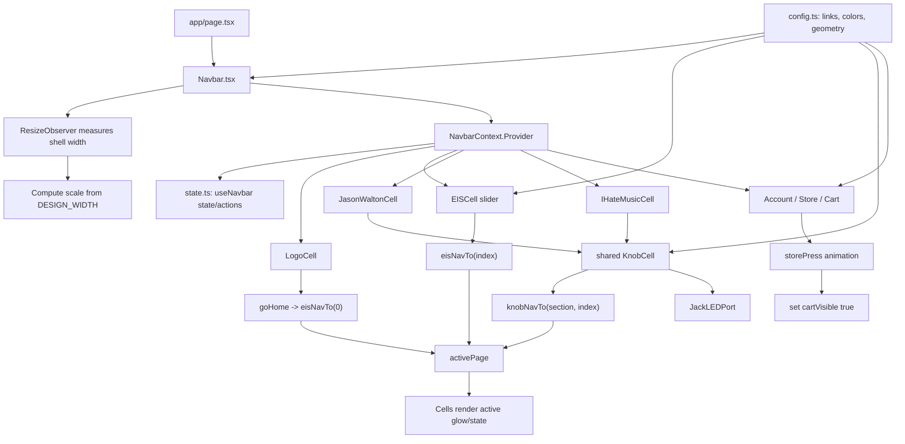

# Project Architecture

This file explains how the current Earth In Sound project is organized and how
the navbar works internally. The README stays limited to project scope; this
document carries the implementation details.

## Application Shape

The project is a Next.js App Router application. `app/page.tsx` renders the
navbar as the first interactive object on the home page. The page itself stays
simple; the navbar owns the current user-facing behavior.

The navbar is a client-side feature because it uses React state, pointer
events, keyboard handlers, and responsive measurements. The rest of the app can
grow around it without forcing every page to become client-rendered.

## File Blocks And Roles

```text
app/
  layout.tsx
  page.tsx
  globals.css

components/navbar/
  Navbar.tsx
  config.ts
  state.ts
  cells/
  shared/
```

`app/layout.tsx` is the root document shell. It imports global CSS and defines
site metadata.

`app/page.tsx` is the home route. It renders the navbar and leaves room for
future page content.

`app/globals.css` owns the global reset, theme tokens, shared navbar cell
layout primitives, shared LED/link label primitives, and reduced-motion rules.
It avoids broad global button resets so future native buttons keep normal
browser behavior.

`components/navbar/Navbar.tsx` owns the physical faceplate. It measures the
available width, applies the responsive scale, preserves the intentional 80%
visual width, defines the cell order, and provides shared state through
`NavbarContext`.

`components/navbar/config.ts` is the static source of truth. It contains
section identifiers, section links, labels, glow colors, knob geometry, settled
cell geometry, navbar design dimensions, and store animation frames.

`components/navbar/state.ts` owns shared React behavior. It defines the navbar
context, the `useNavbar()` hook, shared state, navigation actions, store
animation, responsive measurement, cart visibility, and the keyboard activation
helper used by custom controls.

`components/navbar/cells/` contains the individual visual and interaction
surfaces. Each file represents one navbar cell and is the intended home for
future custom artwork for that area.

`components/navbar/shared/` contains reusable visual mechanisms. `KnobCell.tsx`
is shared by the Jason Walton and I Hate Music sections, and
`JackLEDPort.tsx` renders their shared corner LED/port/cable indicator.

## Navbar Cell Roles

`LogoCell.tsx` renders the Earth In Sound logo and calls `goHome()`, which
sets the EIS section to its Home state.

`EISCell.tsx` renders the vertical three-position slider for Earth In Sound.
It uses Pointer Events so mouse, touch, and stylus input follow one code path.
Releasing the thumb snaps to the nearest valid link index.

`JasonWaltonCell.tsx` and `IHateMusicCell.tsx` are thin section wrappers. They
pass labels, links, and glow colors into the shared `KnobCell`.

`KnobCell.tsx` renders the rotary SVG control, orbiting LEDs, labels, active
indicator dot, and the shared jack indicator. It reads the active section from
context and calls shared navigation actions.

`JackLEDPort.tsx` renders the decorative LED, jack socket, and cable indicator.
Inactive cables are hidden inline as well as through CSS so they do not flash
on refresh before scoped styles settle.

`AccountCell.tsx` renders the local login toggle and username display.

`StoreCell.tsx` runs the store scramble animation. When the animation finishes,
it reveals the cart control.

`CartCell.tsx` renders the item-count badge and cart button. The cart button is
kept out of the tab order and marked disabled until Store reveals it.

## Flow Chart



## State Flow

1. `Navbar.tsx` calls `useNavbar()` and provides the returned state through
   context.
2. A cell calls an action such as `eisNavTo()`, `knobNavTo()`, `goHome()`,
   `toggleLogin()`, or `storePress()`.
3. `state.ts` updates the shared React state.
4. Context consumers re-render with the new active section, slider position,
   account state, store text, or cart visibility.
5. Component-local CSS and CSS variables render the correct glow, motion, and
   active visual state.

## Interaction Guarantees

- Navigation indexes are clamped before entering shared state.
- EIS slider dragging uses one Pointer Events path for mouse and touch.
- Custom div/SVG controls support both Enter and Space activation.
- Active controls expose ARIA state where appropriate.
- Inactive jack cables are hidden on first paint to prevent refresh flashes.
- Reduced-motion users receive near-instant transitions.
