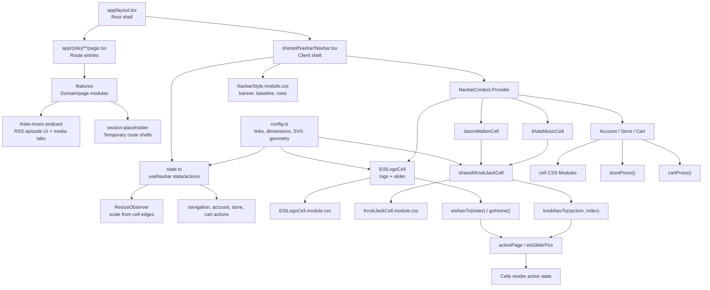

# Project Architecture

This document explains the implementation structure of the Earth In Sound
project. The README describes project scope; this file describes how the code
is engineered.

## Application Shape

The project is a Next.js App Router application. `app/layout.tsx` mounts the
navbar once so it stays visible across every route. Route files under `app/`
stay small and delegate domain-specific page UI to `features/`.

The navbar itself is a Client Component because it uses React state, pointer
events, keyboard handlers, DOM measurements, and responsive scaling.

Styling is split out of component files into CSS Modules. Global CSS is kept
small and only owns the reset, theme tokens, reduced-motion behavior, and tiny
shared navbar primitives.

## Current File Structure

```text
app/
  layout.tsx
  page.tsx
  page.module.css
  globals.css
  (site)/
    about/page.tsx
    account/page.tsx
    cart/page.tsx
    contact/page.tsx
    store/page.tsx
    i-hate-music/
      community/page.tsx
      patreon/page.tsx
      podcast/page.tsx
    jason-walton/
      biography/page.tsx
      discography/page.tsx
      production/page.tsx

features/
  section-placeholder/
    SectionPlaceholderPage.tsx
    SectionPlaceholderPage.module.css
  ihate-music-podcast/
    IHateMusicPodcastPage.tsx
    IHateMusicPodcastPage.module.css
    EpisodeMediaTabs.tsx
    EpisodeMediaTabs.module.css

components/navbar/
  config.ts
  state.ts
  cells/
    AccountCell/
      AccountCell.tsx
      AccountCell.module.css
    CartCell/
      CartCell.tsx
      CartCell.module.css
    EISLogoCell/
      EISLogoCell.tsx
      EISLogoCell.module.css
    IHateMusicCell/
      IHateMusicCell.tsx
      IHateMusicCell.module.css
    JasonWaltonCell/
      JasonWaltonCell.tsx
      JasonWaltonCell.module.css
    StoreCell/
      StoreCell.tsx
      StoreCell.module.css
  shared/
    Navbar/
      Navbar.tsx
      NavbarStyle.module.css
    KnobJackCell/
      KnobJackCell.tsx
      KnobJackCell.module.css

public/
  NavbarAssets/
    Animations/
    Fonts/
    PNG/
    SVG/
```

## File Roles

`app/layout.tsx` is the root document shell. It imports global CSS, defines
site metadata, and mounts the shared navbar above route content.

`app/page.tsx` is the home route. The navbar is already mounted by
`app/layout.tsx`, so the page file only renders home content.

Nested `app/(site)/**/page.tsx` files are route entries only. The `(site)`
folder is a route group, so it organizes public site pages without changing
URLs. Those
route entries define URL boundaries, metadata, and route-specific data loading,
then render feature components from `features/`.

`features/section-placeholder/` owns the temporary route shell used
by unfinished destinations such as About, Store, Cart, and section pages.

`features/ihate-music-podcast/` owns the podcast page UI, episode cards,
audio/video mini-tabs, and YouTube-to-Acast visibility handoff behavior.

`app/page.module.css` owns page-local layout styling, currently the empty
content area's padding.

`app/globals.css` owns the site reset, theme variables, focus ring, shared
navbar primitives such as `.navbar-cell`, `.led`, and `.link-label`, and the
reduced-motion media query.

`components/navbar/config.ts` is the static source of truth for section ids,
link labels, SVG geometry, navbar design dimensions, baseline thickness, knob
layout tuning, and LED/label offsets.

`components/navbar/state.ts` owns shared React behavior. It defines
`NavbarContext`, `useNavbar()`, navigation actions, responsive measurement,
latched store/cart state, account state, and the keyboard activation helper
for custom controls.

`public/NavbarAssets/DesktopAssets/` stores navbar artwork, fonts, videos, SVGs, and bitmap
assets. CSS modules and media elements reference them with root-relative URLs
such as `/NavbarAssets/DesktopAssets/SVG/...`.

## App Router Organization

The `app/` folder is reserved for routing. Folders inside `app/` create URLs,
so route folders should not be moved into `components/`.

`app/(site)/` groups the visible site pages while preserving their public
paths. For example, `app/(site)/about/page.tsx` still serves `/about`.

`features/` holds domain-level behavior and UI that is larger than a reusable
button/card component. This keeps future database, store, account, podcast, and
admin logic from being scattered through generic component folders.

The previous `app/_components/` folder was a valid Next private folder: the
leading underscore tells Next it should not become a route. It was removed in
favor of `features/` so page-level/domain UI has one clear home outside the
router tree. The earlier `components/pages/` name was also removed to avoid
confusion with `app/(site)` route pages.

## Navbar Shell

`components/navbar/shared/Navbar/Navbar.tsx` owns the full navbar shell. It:

- creates the navbar context provider
- measures and scales the shell through `useNavbar()`
- syncs runtime CSS variables needed for scale, width, height, and baseline
- defines the visual cell order

`components/navbar/shared/Navbar/NavbarStyle.module.css` owns the shared
banner, baseline, root faceplate, and single-row layout.
The banner is drawn on `.navbarShell::before` and the baseline is drawn on
`.navbarShell::after`. Both are viewport-painted decorative layers, so they
stay edge-to-edge without changing the navbar's measured layout width.

The navbar uses CSS Modules instead of plain component-level global CSS because
Next's App Router only allows global CSS imports at the root layout boundary.

## Cell Folders

Each cell now has its own folder containing:

- one `.tsx` file for behavior and markup
- one `.module.css` file for that cell's styling

This keeps future custom artwork isolated. If a cell receives a new plaque,
hover state, animation, or layout, the work should happen inside that cell's
folder instead of overloading the shared navbar shell.

## Cell Roles

`EISLogoCell` combines the Earth In Sound logo and the EIS navigation slider
because they share one plaque. The logo calls `goHome()`. The slider supports
pointer dragging, keyboard navigation, and resize-aware snapping.

`JasonWaltonCell` and `IHateMusicCell` are section wrappers. They provide the
section id, label, and link list to the shared `KnobJackCell`.

`KnobJackCell` renders the reusable rotary control: invisible knob hit target,
choice lights, link labels, section knob artwork, and the optional top-right
jack socket/cable overlay used by Jason Walton and I Hate Music.

`AccountCell` renders the login switch and username display.

`StoreCell` shows the idle store artwork, plays the hover video once, and keeps
the pressed store video looping until another navbar action clears it.

`CartCell` renders the item-count badge and cart button. The button can hold
its pressed state until another navbar action clears it.

## Styling Rules

- Component-level visual styling lives in CSS Modules.
- `globals.css` is only for shared primitives and page-level defaults.
- Component files do not contain CSS blocks. `style={...}` is reserved for CSS
  custom-property handoffs and measured behavior, such as navbar scale
  variables, knob layout variables, and slider thumb position.
- New cell artwork should go in the owning cell folder unless it is truly
  shared across multiple cells.
- Decorative artwork that should not move nearby controls uses a slot/art
  split: slot variables reserve layout space, while art variables control the
  visible SVG layer inside that slot.

## Flow Chart


```mermaid
flowchart TD
  Layout["app/layout.tsx<br/>Root shell"] --> Navbar["shared/Navbar/Navbar.tsx<br/>Client shell"]
  Layout --> Routes["app/(site)/**/page.tsx<br/>Route entries"]
  Routes --> Features["features<br/>Domain/page modules"]
  Features --> Podcast["ihate-music-podcast<br/>RSS episode UI + media tabs"]
  Features --> Placeholder["section-placeholder<br/>Temporary route shells"]

  Navbar --> Provider["NavbarContext.Provider"]
  Navbar --> ShellCSS["NavbarStyle.module.css<br/>banner, baseline, rows"]
  Navbar --> State["state.ts<br/>useNavbar state/actions"]
  State --> Measure["ResizeObserver<br/>scale from cell edges"]
  State --> Actions["navigation, account, store, cart actions"]
  Config["config.ts<br/>links, dimensions, SVG geometry"] --> State
  Config --> EIS
  Config --> Knob

  Provider --> EIS["EISLogoCell<br/>logo + slider"]
  Provider --> JW["JasonWaltonCell"]
  Provider --> IHM["IHateMusicCell"]
  Provider --> Utility["Account / Store / Cart"]

  EIS --> EISCSS["EISLogoCell.module.css"]
  JW --> Knob["shared/KnobJackCell"]
  IHM --> Knob
  Knob --> KnobCSS["KnobJackCell.module.css"]
  Utility --> UtilityCSS["cell CSS Modules"]

  EIS --> EISNav["eisNavTo(index) / goHome()"]
  Knob --> KnobNav["knobNavTo(section, index)"]
  Utility --> Store["storePress()"]
  Utility --> Cart["cartPress()"]

  EISNav --> Active["activePage / eisSliderPos"]
  KnobNav --> Active
  Active --> Render["Cells render active state"]
```

## State Flow

1. `Navbar.tsx` calls `useNavbar()` and provides the returned state through
   `NavbarContext`.
2. A cell calls an action such as `eisNavTo()`, `knobNavTo()`, `goHome()`,
   `toggleLogin()`, `storePress()`, or `cartPress()`.
3. `state.ts` updates shared React state.
4. Context consumers re-render with the new active section, slider position,
   account state, store pressed state, or cart pressed state.
5. CSS Modules render the visual state through classes, pseudo-elements, and
   component-local styles.

## Interaction Guarantees

- Navigation indexes are clamped before entering shared state.
- EIS slider dragging uses Pointer Events for mouse, touch, and stylus.
- EIS slider keyboard control supports Arrow keys, Home, and End.
- Custom SVG/div controls support both Enter and Space activation.
- Native buttons are used where the artwork does not require SVG control.
- Active controls expose ARIA state where appropriate.
- The baseline remains edge-to-edge at browser zoom levels.
- Reduced-motion users receive near-instant transitions.
