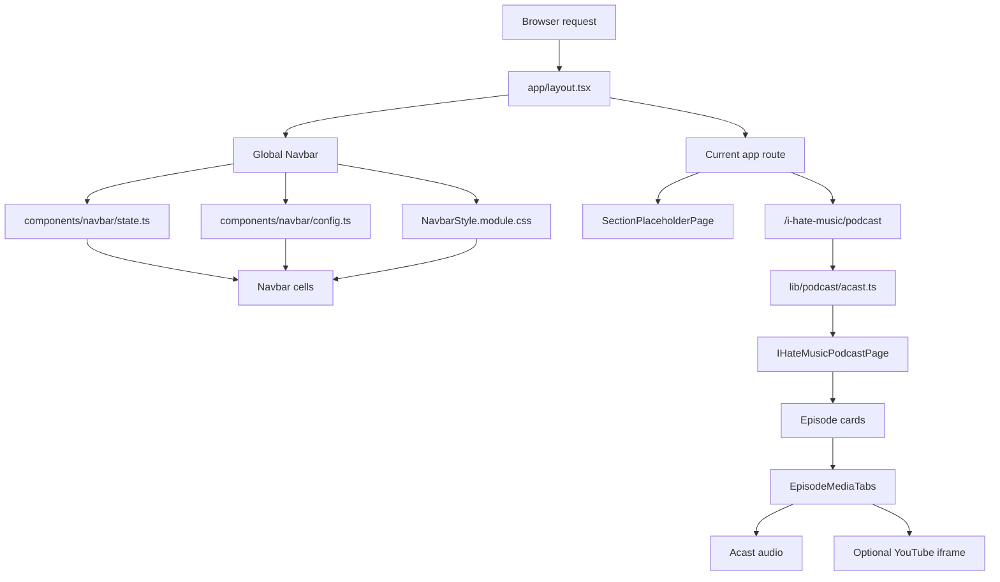

# Earth In Sound Project Code Guide

This file explains how the current project is organized, how information moves
through the website, and which variables control the main behavior. It is meant
as a learning map for future manual changes.

## Project Scope

Earth In Sound is a Next.js website for a production company and podcast. The
current build focuses on:

- a custom artwork-heavy navbar shared by every page;
- route navigation for Earth In Sound, Jason Walton, I Hate Music, Account,
  Store, and Cart;
- an I Hate Music podcast page fed from the public Acast RSS feed;
- episode-level Audio and optional YouTube Video tabs;
- placeholder pages for sections whose final content will be designed later.

## High-Level Flow



## Folder Roles

### `app`

The `app` folder is the Next.js App Router. Files named `page.tsx` define real
URLs. The `(site)` folder is a route group: it organizes files but does not add
`(site)` to the URL.

Important files:

- `app/layout.tsx`: document shell. It mounts `<Navbar />` once above every page.
- `app/globals.css`: global reset, theme variables, and tiny shared navbar
  primitives such as `.navbar-cell`, `.led`, and `.link-label`.
- `app/page.tsx`: home route.
- `app/(site)/.../page.tsx`: individual section routes.
- `app/(site)/i-hate-music/podcast/page.tsx`: loads the Acast feed and renders
  the podcast feature page.

### `components/navbar`

The navbar is a shared component system. It is not route-specific. It controls
the visual hardware navigation and writes route changes through Next routing.

Important files:

- `config.ts`: labels, geometry, navbar heights, knob layout, and shared math.
- `state.ts`: navbar state, route mapping, active page logic, scaling logic, and
  navigation actions.
- `shared/Navbar/Navbar.tsx`: mounts all navbar cells and writes measured CSS
  variables for the browser-safe layout.
- `shared/Navbar/NavbarStyle.module.css`: global navbar banner, baseline, shell,
  root, row, and cross-browser positioning styles.
- `shared/KnobJackCell`: shared rotary knob and jack/cable behavior used by JWW
  and IHM.
- `cells/*`: one folder per visual navbar cell. Each cell owns its component and
  CSS module.

### `features`

Feature folders hold page-level UI that is bigger than a single generic
component.

- `features/section-placeholder`: temporary pages for unfinished sections.
- `features/ihate-music-podcast`: podcast page, media tabs, YouTube helper, and
  media timing helper.

### `lib`

`lib` holds non-visual logic.

- `lib/podcast/acast.ts`: fetches and parses the public Acast RSS feed on the
  server.

### `public/NavbarAssets`

Artwork, fonts, and video assets live here. CSS files can reference these with
absolute public paths such as:

```css
background-image: url("/NavbarAssets/DesktopAssets/SVG/BaseBannerNavbar.svg");
```

## Navbar Rendering Flow

1. `app/layout.tsx` renders `<Navbar />` before `{children}`.
2. `Navbar.tsx` calls `useNavbar()` from `state.ts`.
3. `useNavbar()` returns shared state and actions:
   - active section/page;
   - EIS slider position;
   - account/store/cart states;
   - responsive scale;
   - refs for measuring the shell and cell row.
4. `Navbar.tsx` renders the six cells in one row:
   - `EISLogoCell`
   - `JasonWaltonCell`
   - `IHateMusicCell`
   - `AccountCell`
   - `StoreCell`
   - `CartCell`
5. `Navbar.tsx` writes CSS variables used by `NavbarStyle.module.css`.
6. Each cell reads shared state through `useNavbarContext()`.
7. Clicking a cell action updates navbar state and, when needed, pushes a route.

## Navbar Measurement and Scaling

The navbar has two related systems:

### 1. Scale Calculation in `state.ts`

`state.ts` decides how much the artwork cells should shrink when the real window
is too small.

Key variables:

- `shellRef`: points to the outer navbar shell.
- `contentRef`: points to the cell row.
- `designContentWidthRef`: stores the full-size row width before scaling.
- `scale`: the current artwork scale. `1` means full size.
- `isScaleReady`: hides the navbar until the first stable measurement is done.
- `baselinePixelRatio`: browser zoom baseline for the current session.
- `baselinePhysicalShellWidth`: detects real viewport/device changes versus
  browser zoom.
- `resizeOnlyShellWidth`: viewport width corrected so browser zoom does not
  cancel itself.
- `fullScaleNavbarRowWidth`: full-size row width used to decide when shrinking
  should begin.

Behavior:

- If the window is wide enough, `scale` stays `1`.
- If the window becomes narrower than the full cell row, `scale` becomes
  `window width / full row width`.
- Browser zoom is allowed to behave like real zoom instead of being neutralized.

### 2. Cross-Browser Row Positioning in `Navbar.tsx`

Different browsers can report wrapper widths differently when children overflow.
To avoid that, `Navbar.tsx` measures the actual navbar cell children.

Key helper functions:

- `toNonNegativePixelValue`: converts a number to a safe CSS pixel string.
- `readHorizontalMarginWidth`: reads left and right margins for one cell.
- `measureRenderedNavbarCellsWidth`: sums the rendered width of every navbar
  cell plus margins.
- `setCssVariable`: writes a CSS variable only when the value changed.

Key measured variables:

- `visibleViewportWidth`: visual viewport width reported by the browser.
- `renderedNavbarRowWidth`: real rendered width of the cells.
- `navbarOverflowLayoutWidth`: larger of viewport width and row width. This
  creates natural horizontal scrolling only when needed.
- `centeredNavbarRowOffset`: left offset used to center the row while it fits.

CSS variables written by React:

- `--navbar-viewport-width`: shared width for shell, banner, and baseline.
- `--navbar-layout-width`: width of the interactive navbar root.
- `--navbar-row-width`: exact width of the cell row.
- `--navbar-row-offset`: left offset for centering.
- `--navbar-root-height`: faceplate height without the baseline.
- `--artwork-cell-scale`: scale used by all artwork inside navbar cells.

## Navbar CSS Layers

In `NavbarStyle.module.css`:

- `.navbarShell`: sticky outer area. It owns the visible navbar height.
- `.navbarShell::before`: fixed viewport banner artwork.
- `.navbarShell::after`: fixed viewport baseline artwork.
- `.navbarRoot`: interactive layer above the banner.
- `.navbarInner`: measured row wrapper positioned by CSS variables.
- `.rowPrimary`: actual flex row containing the six cells.

Layer variables:

- `--navbar-layer-banner`: background banner z-index.
- `--navbar-layer-cells`: interactive cells z-index.
- `--navbar-layer-baseline`: baseline z-index.

## Navbar State and Route Flow

`state.ts` keeps the navbar visuals synchronized with real routes.

Important route constants:

- `HOME_ROUTE`
- `ACCOUNT_ROUTE`
- `CART_ROUTE`
- `I_HATE_MUSIC_PODCAST_ROUTE`
- `STORE_ROUTE`

Important maps:

- `NAVBAR_LINK_ROUTES`: maps section/link indexes to target URLs.
- `ACTIVE_PAGE_BY_ROUTE`: maps current URLs back to navbar active visuals.

Important state:

- `activePage`: currently selected navbar section and link index.
- `eisSliderPos`: current EIS slider stop.
- `isLoggedIn`: temporary account login state.
- `cartCount`: temporary cart count seed.
- `isCartPressed`: whether the cart button is visually latched.
- `isStorePressed`: whether the store screen is visually latched.
- `visualState.sourcePathname`: prevents stale visual state from leaking across
  route changes.

Important actions:

- `eisNavTo`: moves EIS slider and navigates Home/About/Contact.
- `knobNavTo`: moves JWW/IHM knobs and navigates their section links.
- `knobFacePress`: clicking a knob face cycles through its section links.
- `goHome`: shortcut to EIS Home.
- `toggleLogin`: toggles temporary login state.
- `openAccountPage`: opens the future account route.
- `resetActiveNavbarControls`: clears active section/store/cart visuals.
- `storePress`: latches Store and opens `/store`.
- `cartPress`: latches Cart and opens `/cart` if the count is above zero.

## Navbar Cell Roles

### `EISLogoCell`

Owns:

- Earth In Sound plaque artwork;
- logo off/hover states;
- EIS vertical slider;
- Home/About/Contact buttons and LEDs.

Important local variables:

- `LAST_EIS_INDEX`: highest valid slider index.
- `trackRef`: slider rail element.
- `thumbRef`: slider thumb element.
- `dragStateRef`: mutable pointer drag session.
- `isActive`: whether EIS is the active navbar section.
- `activeLabel`: accessible text for the current slider stop.

### `JasonWaltonCell`

Owns:

- Jason Walton plaque and logo artwork;
- Jason-specific knob artwork;
- first-link logo behavior.

It passes shared behavior into `KnobJackCell`.

### `IHateMusicCell`

Owns:

- I Hate Music plaque and logo artwork;
- IHM-specific knob artwork;
- first-link logo behavior.

It also passes shared behavior into `KnobJackCell`.

### `KnobJackCell`

Shared by Jason Walton and I Hate Music.

Owns:

- knob click behavior;
- knob vertical drag behavior;
- SVG hit targets;
- LEDs and labels;
- jack socket and cable visibility.

Important variables:

- `sectionLinks`: labels for the current knob section.
- `sectionIsActive`: whether this specific knob section is active.
- `activeLinkIndex`: active stop inside that section.
- `dragState`: pointer session for knob dragging.
- `suppressNextClick`: avoids a drag ending as an extra click.
- `choiceGeometry`: computed LED/label SVG positions.

### `AccountCell`

Owns:

- login/logout switch;
- login/logout status panel;
- account/signup screen button.

Temporary state comes from `state.ts`. Later, this should connect to the real
auth/backend layer.

### `StoreCell`

Owns:

- static store screen artwork;
- one-shot hover video;
- looping pressed video;
- store route activation.

Important variables:

- `isHovered`: controls hover animation visibility.
- `hoverVideoRef`: hover animation video element.
- `pressedVideoRef`: active store animation video element.
- `isStorePressed`: visual latch state from navbar state.

### `CartCell`

Owns:

- cart plaque artwork;
- cart counter display;
- cart button off/hover/pressed states.

Important variables:

- `cartCount`: temporary count seeded in navbar state.
- `cartCounterText`: two-digit display string.
- `isCartPressed`: visual latch state.

## Podcast Data Flow

### Server Data in `lib/podcast/acast.ts`

`getIHateMusicShow()` fetches the public Acast RSS feed and converts it into
plain TypeScript objects.

Important constants:

- `I_HATE_MUSIC_ACAST_EPISODES_URL`: public Acast page.
- `I_HATE_MUSIC_ACAST_FEED_URL`: RSS feed source.
- `PODCAST_FEED_REVALIDATE_SECONDS`: cache interval. Currently one hour.

Important output types:

- `PodcastShow`: show-level data, image, keywords, and episodes.
- `PodcastEpisode`: title, description, date, duration, Acast link, and audio.

Important helpers:

- `mapEpisode`: converts one RSS item into a `PodcastEpisode`.
- `asArray`: normalizes RSS fields that can be single objects or arrays.
- `splitKeywords`: turns comma-separated RSS keywords into a list.
- `cleanTextOrNull`: cleans optional feed text.
- `cleanAcastText`: strips RSS HTML and Acast footer text.
- `decodeHtmlEntities`: converts HTML entities into readable text.

### Route Entry in `app/(site)/i-hate-music/podcast/page.tsx`

This file:

- sets route metadata;
- sets `revalidate = 3600`;
- calls `getIHateMusicShow()`;
- catches feed errors and renders the podcast page with `show = null` if needed.

### Page Renderer in `IHateMusicPodcastPage.tsx`

This file:

- renders the podcast hero;
- shows show metadata;
- highlights the newest episode;
- renders the episode archive;
- creates an `EpisodeCard` for each episode.

Important variables:

- `latestEpisode`: first episode from the feed.
- `archiveEpisodes`: remaining episodes.
- `hostLabel`: page intro label.
- `languageLabel`: uppercase language display.

### Episode Media in `EpisodeMediaTabs.tsx`

Each episode has Audio and Video tabs.

Audio behavior:

- Acast audio is primary.
- It uses native `<audio controls>`.
- It can continue when the tab is hidden or screen is off, as long as the
  browser permits normal audio playback.

Video behavior:

- YouTube links are manually pasted for testing/future super-user workflow.
- Video tab creates a YouTube iframe only when a valid link exists.
- If YouTube is playing and the page becomes hidden, Acast audio resumes from
  the same timestamp.
- When visible again, YouTube seeks to the Acast audio time and resumes.

Important variables:

- `activeMode`: current tab, either `audio` or `video`.
- `youtubeUrlInput`: typed form value.
- `youtubeUrl`: accepted YouTube URL.
- `youtubeVideoId`: parsed video ID.
- `videoContinuityIsEnabled`: true only when Video tab has a valid YouTube ID.
- `shouldResumeVideoFromAudioRef`: stores whether hidden audio should hand back
  to video when visible again.

### YouTube Helper in `youtubePlayer.ts`

This file isolates YouTube iframe API details.

Important pieces:

- `parseYouTubeVideoId`: accepts plain IDs, `youtu.be`, `watch`, `embed`,
  `shorts`, and `live` URLs.
- `loadYouTubeIframeApi`: loads the global YouTube API script once.
- `createYouTubePlayer`: creates the iframe player in a DOM node.

## Styling Rules

The project uses CSS Modules for component styles and `app/globals.css` for
global primitives only.

Current rule of thumb:

- Page layout styles live beside the page/feature.
- Navbar cell artwork lives in each cell CSS module.
- Shared navbar primitives live in `globals.css`.
- Shared whole-navbar shell/baseline/banner styles live in
  `NavbarStyle.module.css`.

## Key Variables Glossary

### Navbar Sizing

- `DESIGN_HEIGHT`: total navbar height including baseline.
- `BASE_LINE_HEIGHT`: visual height reserved for the baseline artwork.
- `ARTWORK_CELL_SCALE_BASE_HEIGHT`: design height used to calculate artwork
  scaling.
- `scale`: live navbar scale from `state.ts`.
- `--artwork-cell-scale`: CSS-facing version of `scale` used by cell artwork.
- `--cell-plaque-height`: global plaque height target used by navbar cells.

### Knob Layout

- `KNOB_LAYOUT.dragStepPx`: pointer movement required for one knob stop.
- `KNOB_LAYOUT.choiceLightSize`: LED artwork size in SVG coordinates.
- `KNOB_LAYOUT.labelOrbitGap`: distance from LED orbit to label orbit.
- `KNOB_LAYOUT.module`: shared knob module max width and placement offset.
- `KNOB_LAYOUT.artwork`: visible knob size, position, press scale, and rotation.
- `KNOB_LAYOUT.jack`: socket/cable size and anchor correction.
- `KNOB_OFFSETS`: per-link nudges for LEDs and labels.

### Podcast

- `PODCAST_FEED_REVALIDATE_SECONDS`: how often Next refreshes Acast data.
- `audioUrl`: Acast episode audio file.
- `audioMimeType`: MIME type for the audio source.
- `youtubeUrl`: accepted video URL for the episode media tab.
- `youtubeVideoId`: parsed ID passed to YouTube iframe API.

## Future-Safe Editing Notes

- Keep route changes in `state.ts` maps so navbar visuals and URLs stay synced.
- Keep asset URLs in CSS modules unless a component truly needs runtime logic.
- When changing navbar sizing, update `config.ts` first.
- When changing plaque/content scale, prefer CSS variables based on
  `--artwork-cell-scale`.
- Avoid using wrapper widths to center the navbar. The current row measurement
  deliberately reads actual cells to avoid Firefox/Safari/Chromium differences.
- Keep RSS parsing server-side in `lib/podcast/acast.ts`.
- When real auth/cart/store backends arrive, replace the seeded temporary state
  in `state.ts` with real data sources rather than duplicating state in cells.
