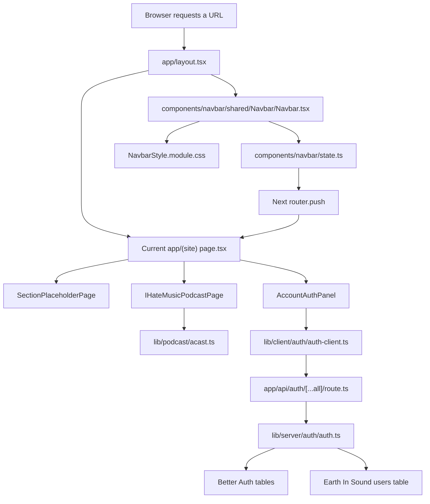
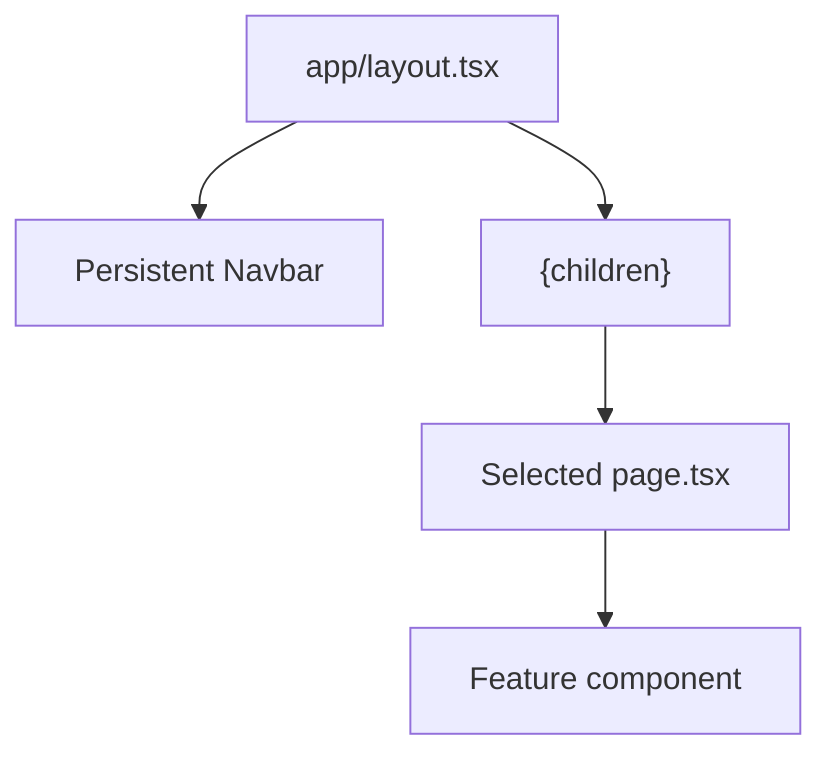
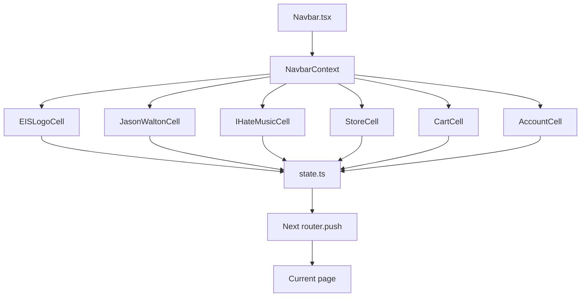
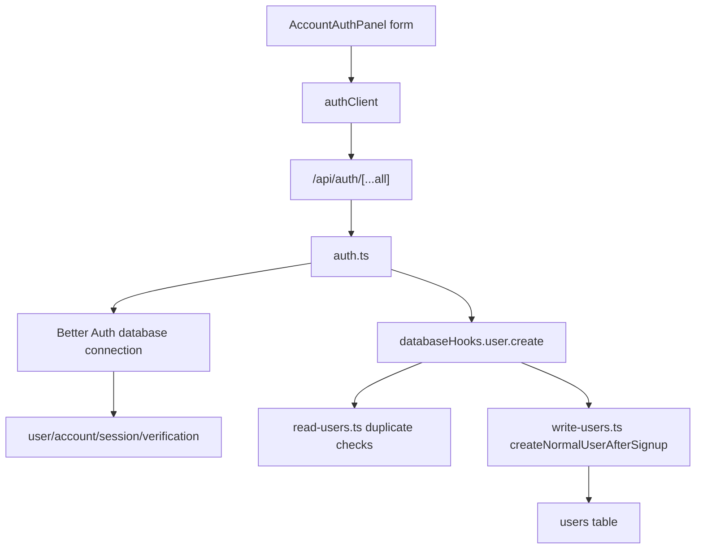
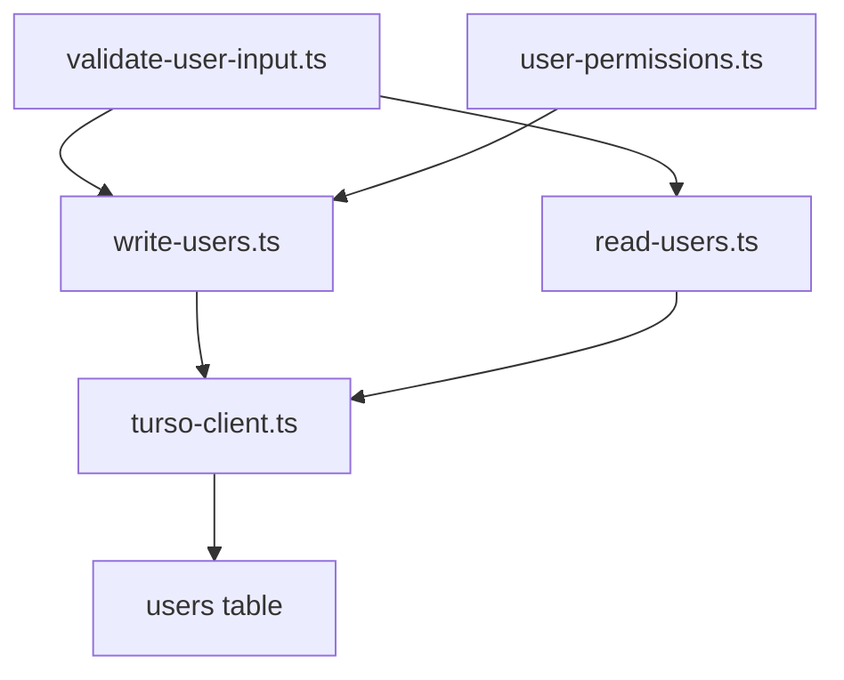
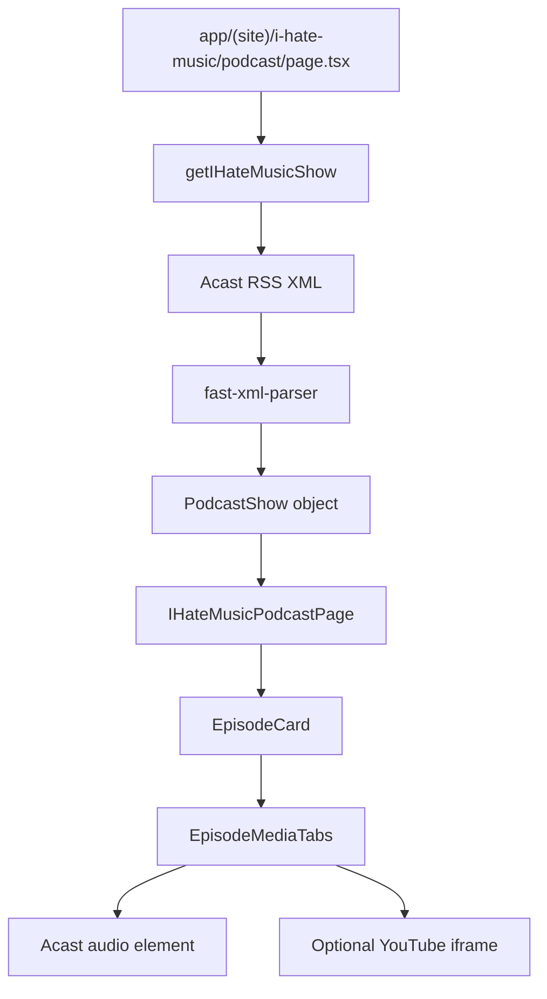
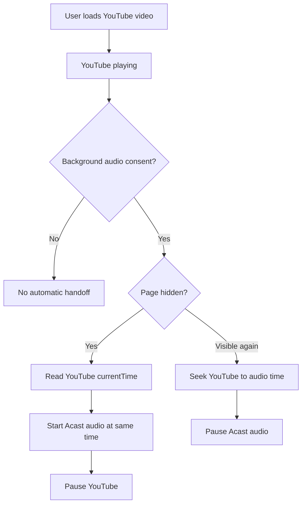

# Earth In Sound Learning Flow

This file is a reading map for the project. Use it beside the code when you
want to understand how files communicate with each other.

## Core Idea

The project is split into four major systems:

- `app`: Next.js routes and page shell.
- `components/navbar`: persistent interactive navbar.
- `features`: page-level UI such as account auth and podcast pages.
- `lib` and `database`: server data, external feeds, auth, and database rules.

The important rule is:

```text
UI components call small client/server entry points.
Entry points call feature/database functions.
Database functions own data rules.
```

## Whole Website Flow



## App Router Flow

`app/layout.tsx` is the permanent shell. It renders:

```text
Navbar
current page
```

That is why the navbar appears on every page.

Each `app/(site)/.../page.tsx` file is a route. Most routes currently render the
shared placeholder feature. The podcast route is different because it fetches
real RSS data before rendering.



## Navbar Flow

The navbar is divided into:

- `Navbar.tsx`: orders the cells and writes measured CSS variables.
- `NavbarStyle.module.css`: paints the full-width banner and baseline.
- `state.ts`: owns active route, selected controls, cart/store latch state, and scaling.
- `config.ts`: owns labels, geometry, knob positions, heights, and tuning values.
- `cells/*`: each visual cell owns its artwork and local controls.



### Navbar Scaling

The navbar has two different visual responsibilities:

1. The background banner must stay edge-to-edge.
2. The cell row must stay centered when it fits, and overflow/scroll naturally
   when browser zoom makes it wider than the viewport.

`Navbar.tsx` measures the visible row and writes CSS variables:

```text
--navbar-shell-height
--navbar-root-height
--artwork-cell-scale
--navbar-layout-width
--navbar-paint-width
--navbar-row-width
--navbar-row-offset
```

`NavbarStyle.module.css` consumes those variables.

`state.ts` computes the scale used for real window resizing. It tries to avoid
treating browser zoom as a small window, so zoom can create natural horizontal
overflow.

## Auth Flow

There are two auth-related layers:

```text
Better Auth: passwords, sessions, cookies.
Earth In Sound users table: username, role, status.
```



### Signup Step By Step

1. `AccountAuthPanel.tsx` collects email, username, and password.
2. It calls `authClient.signUp.email`.
3. `authClient` sends an HTTP request to `/api/auth/[...all]`.
4. The route forwards the request to `auth.ts`.
5. Better Auth validates password rules and prepares to create an auth user.
6. `databaseHooks.user.create.before` validates email and username.
7. The hook checks the project `users` table for duplicate email/username.
8. Better Auth creates its own auth user and stores password/session data.
9. `databaseHooks.user.create.after` calls `createNormalUserAfterSignup`.
10. `createNormalUserAfterSignup` creates a project `users` row with:

```text
role = "user"
status = "active"
auth_provider_user_id = Better Auth user.id
```

Public signup cannot create an admin or owner.

### Auth File Roles

`lib/client/auth/auth-client.ts`

Browser-side remote control. It gives React components methods like
`signIn.email`, `signUp.email`, `signOut`, and `useSession`.

`app/api/auth/[...all]/route.ts`

Next.js API route. It receives browser auth requests and delegates them to
Better Auth.

`lib/server/auth/auth.ts`

Server-side Better Auth configuration. It defines password rules, database
hooks, cookies, and the connection to Better Auth tables.

`lib/server/auth/better-auth-database.ts`

Kysely/LibSQL connection that Better Auth uses for its own tables.

## Project User Database Flow

The `users` table is your application profile table. It is not the same thing
as Better Auth's auth user table.



### User Status Meaning

```text
active:
  User can act normally.

disabled:
  User is temporarily blocked.
  Email and username remain reserved.
  User can be reactivated.

deleted:
  Account is soft-deleted.
  Row remains for history.
  auth_provider_user_id is released.
  email_lookup is released so the email can be used again.
```

### User Role Meaning

```text
owner:
  Highest role.
  Only one owner should exist.
  Can transfer ownership.
  Can promote/demote admins and users.

admin:
  Can manage normal users.
  Cannot promote/demote roles.
  Cannot manage owner.

user:
  Normal account.
  Can manage own allowed account actions.
```

## Podcast Flow



`lib/podcast/acast.ts` is the external-data boundary. It turns raw RSS XML into
plain objects.

`IHateMusicPodcastPage.tsx` renders the page from those objects.

`EpisodeMediaTabs.tsx` gives each episode:

- Audio tab using Acast audio.
- Video tab using a manually pasted YouTube URL.
- Optional background audio handoff when the user consents.

## Video/Audio Handoff Flow



## How To Read The Code

Recommended order:

1. `app/layout.tsx`
2. `components/navbar/shared/Navbar/Navbar.tsx`
3. `components/navbar/state.ts`
4. `components/navbar/config.ts`
5. One navbar cell, such as `EISLogoCell.tsx`
6. `features/account-auth/AccountAuthPanel.tsx`
7. `lib/client/auth/auth-client.ts`
8. `app/api/auth/[...all]/route.ts`
9. `lib/server/auth/auth.ts`
10. `lib/server/database/users/write/write-users.ts`
11. `lib/server/database/users/read/read-users.ts`
12. `lib/podcast/acast.ts`
13. `features/ihate-music-podcast/IHateMusicPodcastPage.tsx`
14. `features/ihate-music-podcast/EpisodeMediaTabs.tsx`

The pattern to look for is:

```text
Component receives data or user action.
Component calls a function.
Function validates input.
Function reads/writes database or route state.
UI reacts to the new state.
```
