# Project_Explained: Earth In Sound Course Guide

This file is the main learning map for the Earth In Sound project.

> Open this file in VS Code and press **Ctrl + Shift + V** to see Mermaid
> diagrams rendered as visual schemas.

This guide is written like a course. Each major section follows the same order:

```text
1. Visual schema.
2. The real code block that creates the behavior.
3. What each block does.
4. How the data or action moves to the next file.
5. What you can safely modify later.
```

## 1. Whole Project Mental Model

The project is split into four layers:

```text
app/
  Next.js routing and page shell.

components/navbar/
  Persistent interactive navbar that appears on every page.

features/
  Page-level UI features such as Account and I Hate Music Podcast.

lib/ and database/
  Server helpers, auth setup, database functions, podcast RSS parsing,
  database setup scripts, and tests.
```

The most important rule is:

```text
UI should not own database rules.
UI should call a small function.
That function should validate input.
Then it can read/write data or navigate.
```

### Whole Website Schema

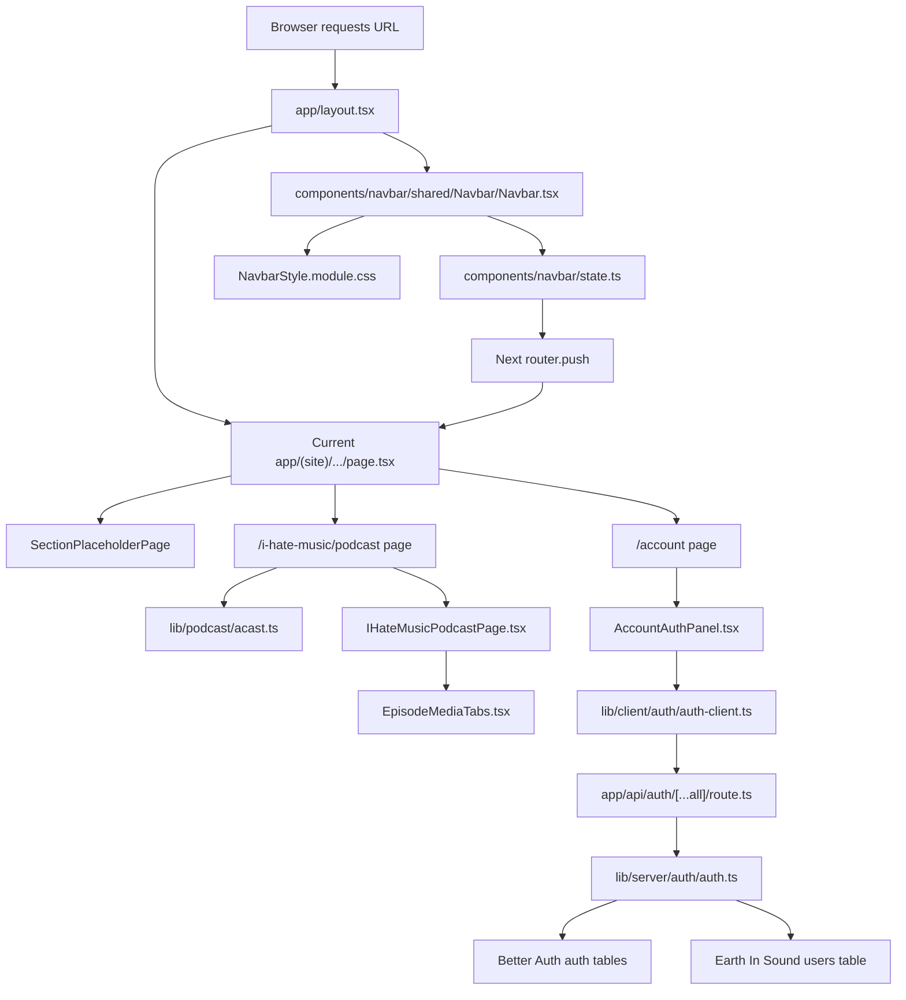

## 2. App Router And Permanent Navbar

The file that makes the navbar visible on every page is:

```text
app/layout.tsx
```

### App Shell Schema

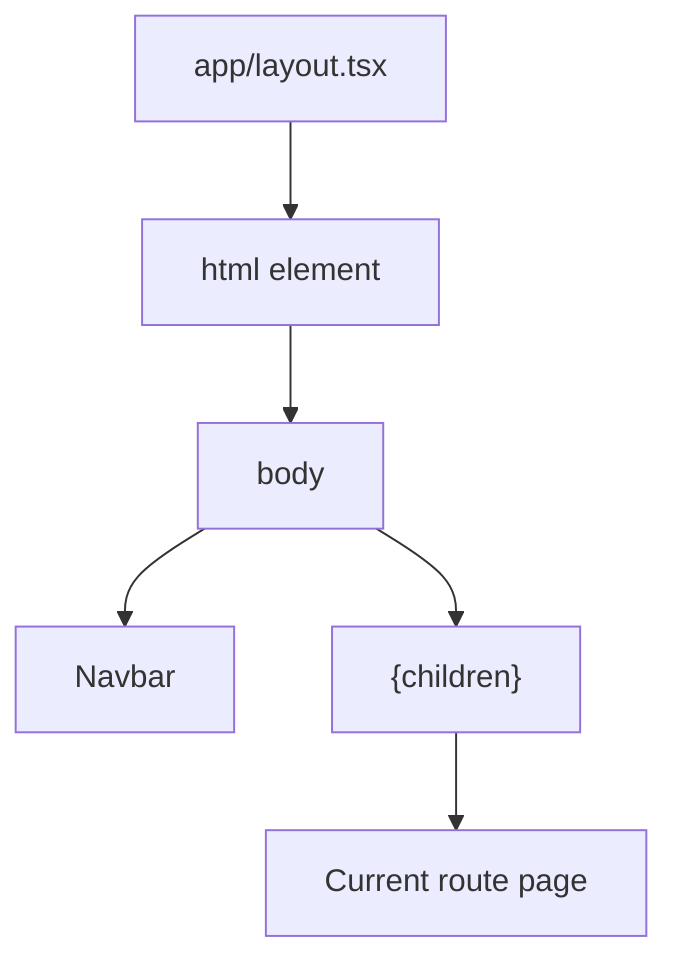

### Real Code

```tsx
import type { Metadata } from "next";
import type { ReactNode } from "react";
import Navbar from "@/components/navbar/shared/Navbar/Navbar";
import "./globals.css";

export const metadata: Metadata = {
  title: "Earth In Sound",
  description: "Earth In Sound official site",
};

interface RootLayoutProps {
  children: ReactNode;
}

export default function RootLayout({ children }: RootLayoutProps) {
  return (
    <html lang="en" data-scroll-behavior="smooth">
      <body suppressHydrationWarning>
        <Navbar />
        {children}
      </body>
    </html>
  );
}
```

### What The Code Does

```tsx
import Navbar from "@/components/navbar/shared/Navbar/Navbar";
```

This imports the navbar once at the root level.

```tsx
<Navbar />
{children}
```

This is the key structure.

- `<Navbar />` is always rendered.
- `{children}` is whichever route is currently active.
- When the URL changes, Next.js swaps `{children}`.
- The navbar stays mounted because it lives above the page content.

```tsx
<body suppressHydrationWarning>
```

This prevents browser extension attributes from causing a noisy hydration
warning. You saw an example with `cz-shortcut-listen="true"`. That attribute was
added by a browser extension, not by your code.

### Safe Change Area

If you want the navbar to appear on all pages, keep it in `app/layout.tsx`.

If you ever want a page without the navbar, you would need a separate layout
group. Do not remove `<Navbar />` from this file unless you want the navbar gone
globally.

## 3. Navbar Structure

The navbar has three important files:

```text
components/navbar/shared/Navbar/Navbar.tsx
components/navbar/shared/Navbar/NavbarStyle.module.css
components/navbar/state.ts
```

And one important configuration file:

```text
components/navbar/config.ts
```

### Navbar Schema

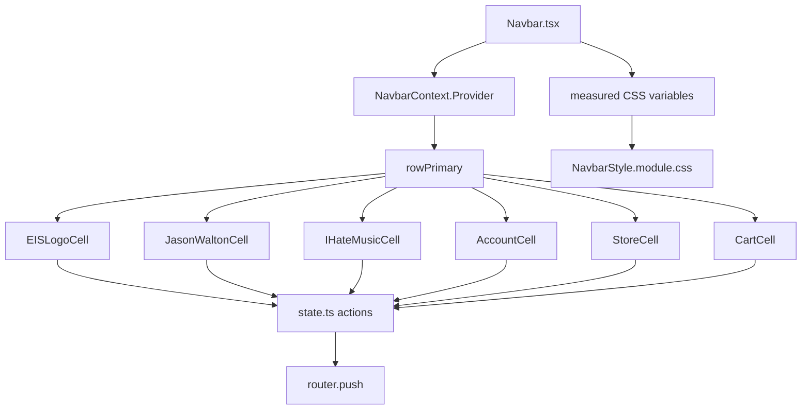

### Navbar.tsx Real Cell Order

```tsx
<NavbarContext.Provider value={navbarState}>
  <div
    ref={shellRef}
    className={`${styles.navbarShell} ${
      isScaleReady ? styles.navbarShellReady : ""
    }`}
  >
    <div
      ref={rootRef}
      className={styles.navbarRoot}
      role="navigation"
      aria-label="Earth In Sound site navigation"
    >
      <div className={styles.navbarInner}>
        <div ref={contentRef} className={styles.rowPrimary}>
          <EISLogoCell />
          <JasonWaltonCell />
          <IHateMusicCell />
          <AccountCell />
          <StoreCell />
          <CartCell />
        </div>
      </div>
    </div>
  </div>
</NavbarContext.Provider>
```

### What This Block Does

```tsx
<NavbarContext.Provider value={navbarState}>
```

This makes the navbar state available to every cell.

Every cell can call:

```ts
useNavbarContext()
```

That gives it actions like:

```ts
eisNavTo(...)
knobNavTo(...)
knobFacePress(...)
storePress()
cartPress()
openAccountPage()
```

```tsx
ref={shellRef}
ref={rootRef}
ref={contentRef}
```

These refs are DOM measuring hooks:

- `shellRef` is the full navbar shell.
- `rootRef` is the interactive faceplate layer.
- `contentRef` is the actual row of cells.

The code measures the real rendered width of `contentRef` so the navbar can
center, shrink on real window resize, and overflow on browser zoom.

## 4. Navbar Background, Baseline, And Row CSS

The navbar background is not inside a cell. It is painted by CSS on the shell.

### Real CSS

```css
.navbarShell {
  --navbar-layout-width: 100vw;
  --navbar-paint-width: 100vw;
  --navbar-shell-height: 132px;
  --navbar-line-height: 8px;
  --navbar-layer-banner: 1000;
  --navbar-layer-cells: 1001;
  --navbar-layer-baseline: 1002;

  position: sticky;
  top: 0;
  z-index: var(--navbar-layer-banner);
  width: var(--navbar-layout-width);
  height: var(--navbar-shell-height);
  overflow: visible;
  visibility: hidden;
  background: transparent;
}
```

### What This Block Does

```css
position: sticky;
top: 0;
```

The navbar stays at the top while the page scrolls.

```css
visibility: hidden;
```

The navbar starts hidden until measuring is ready. This avoids a first-frame
flash where the layout would appear in the wrong place or wrong scale.

```css
width: var(--navbar-layout-width);
```

This width comes from `Navbar.tsx`. It is measured, not guessed.

### Background And Baseline Layers

```css
.navbarShell::before,
.navbarShell::after {
  content: "";
  position: absolute;
  left: 0;
  width: var(--navbar-paint-width);
  pointer-events: none;
}

.navbarShell::before {
  top: 0;
  height: var(--navbar-shell-height);
  z-index: var(--navbar-layer-banner);
  background-image: url("/NavbarAssets/DesktopAssets/SVG/BaseBannerNavbar.svg");
  background-repeat: no-repeat;
  background-position: center;
  background-size: cover;
}

.navbarShell::after {
  top: calc(var(--navbar-shell-height) - var(--navbar-line-height));
  z-index: var(--navbar-layer-baseline);
  height: var(--navbar-line-height);
  background-image: url("/NavbarAssets/DesktopAssets/SVG/BaseLineNavbar.svg");
  background-repeat: no-repeat;
  background-position: left top;
  background-size: 100% 100%;
}
```

### What This Block Does

```css
.navbarShell::before
```

This paints the full banner.

```css
.navbarShell::after
```

This paints the baseline.

```css
width: var(--navbar-paint-width);
```

This is why the banner and baseline can stretch edge-to-edge separately from the
interactive cells.

The cells can be centered or overflow.
The background can still paint as a full strip.

### Row CSS

```css
.navbarInner {
  position: relative;
  z-index: 2;
  display: flex;
  width: var(--navbar-row-width);
  margin-left: var(--navbar-row-offset);
  flex-wrap: nowrap;
  justify-content: flex-start;
  align-items: stretch;
  height: 100%;
  padding: 0;
}

.rowPrimary {
  display: flex;
  flex: 0 0 var(--navbar-row-width);
  flex-wrap: nowrap;
  align-items: stretch;
  justify-content: flex-start;
  width: var(--navbar-row-width);
}
```

### What This Block Does

```css
width: var(--navbar-row-width);
```

The row width is measured from the actual cells.

```css
margin-left: var(--navbar-row-offset);
```

If the cell row fits inside the viewport, this offset centers it.

If the cell row is wider than the viewport, this offset becomes `0px`, and the
browser can show natural horizontal overflow.

## 5. Navbar Measuring And Scaling

This is the part that makes the navbar behave differently for real window resize
versus browser zoom.

### Scaling Schema

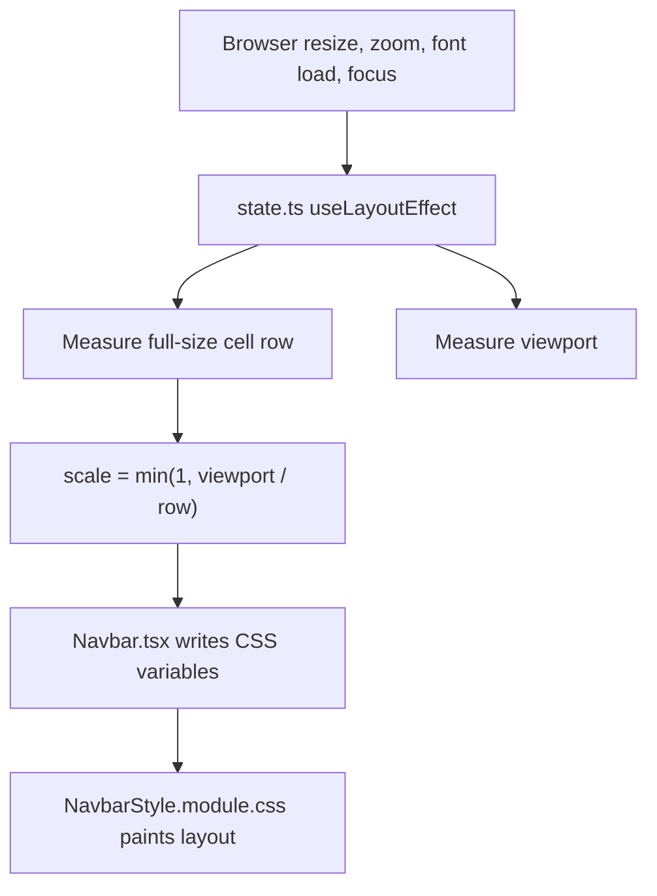

### state.ts Scale Calculation

```ts
const baselineDevicePixelRatio = window.devicePixelRatio || 1;

const getResizeOnlyViewportWidth = (): number => {
  const currentDevicePixelRatio =
    window.devicePixelRatio || baselineDevicePixelRatio;
  const cssViewportWidth = getLayoutViewportWidth(shellElement);

  return (
    cssViewportWidth *
    (currentDevicePixelRatio / baselineDevicePixelRatio)
  );
};
```

### What This Block Does

Browser zoom changes CSS pixels and `devicePixelRatio`.

This function tries to avoid treating browser zoom exactly like a smaller
window. That matters because the intended behavior is:

```text
Real browser window resize:
  navbar may scale down.

Browser zoom:
  navbar should remain visually zoomed and may overflow horizontally.
```

### state.ts Row Width Memory

```ts
const designContentWidthRef = useRef(0);

const syncFullScaleNavbarRowWidth = (): number => {
  const renderedNavbarRowWidth = getNavbarContentWidth(contentElement);
  const currentArtworkScale = getCurrentArtworkScale();
  const normalizedNavbarRowWidth =
    renderedNavbarRowWidth * (fullArtworkScale / currentArtworkScale);

  if (normalizedNavbarRowWidth > 0) {
    designContentWidthRef.current = normalizedNavbarRowWidth;
  }

  return designContentWidthRef.current;
};
```

### What This Block Does

The navbar needs to remember how wide the full-size artwork row is.

Why?

If the row is already scaled down, measuring only the current visible width would
make the next scale calculation weaker and weaker. The ref keeps the full design
width as the reference.

### state.ts Final Scale

```ts
const syncScaleFromCellEdges = () => {
  const resizeOnlyViewportWidth = getResizeOnlyViewportWidth();
  const fullScaleNavbarRowWidth = syncFullScaleNavbarRowWidth();
  const nextScale =
    fullScaleNavbarRowWidth > 0
      ? Math.min(1, resizeOnlyViewportWidth / fullScaleNavbarRowWidth)
      : 1;

  setScale((currentScale) =>
    Math.abs(currentScale - nextScale) > 0.001 ? nextScale : currentScale,
  );
  setIsScaleReady(true);
};
```

### What This Block Does

```ts
Math.min(1, resizeOnlyViewportWidth / fullScaleNavbarRowWidth)
```

This means:

- never scale above `1`
- only shrink when the available resize-width is smaller than the full cell row

```ts
Math.abs(currentScale - nextScale) > 0.001
```

This prevents jitter from tiny browser measurement differences.

## 6. Navbar Geometry Variables Written By Navbar.tsx

`state.ts` computes `scale`.

`Navbar.tsx` converts live DOM measurements into CSS variables.

### Real Code

```ts
setCssVariable(
  shellElement,
  "--navbar-shell-height",
  `${DESIGN_HEIGHT * scale}px`,
);

setCssVariable(
  shellElement,
  "--navbar-line-height",
  `${BASE_LINE_HEIGHT * scale}px`,
);

setCssVariable(
  rootElement,
  "--navbar-root-height",
  `${(DESIGN_HEIGHT - BASE_LINE_HEIGHT) * scale}px`,
);

setCssVariable(
  rootElement,
  "--artwork-cell-scale",
  String(
    (scale * (DESIGN_HEIGHT - BASE_LINE_HEIGHT)) /
      ARTWORK_CELL_SCALE_BASE_HEIGHT,
  ),
);
```

### What This Block Does

```ts
DESIGN_HEIGHT
```

This is the total navbar height from `config.ts`.

```ts
BASE_LINE_HEIGHT
```

This is the baseline artwork height.

```ts
DESIGN_HEIGHT - BASE_LINE_HEIGHT
```

This is the interactive faceplate height, meaning the cell area without the
baseline.

```ts
--artwork-cell-scale
```

Every navbar cell uses this variable so artwork and inner elements scale
together.

### Real Width Calculation

```ts
const visibleViewportWidth = Math.round(getLayoutViewportWidth());
const paintViewportWidth = Math.round(
  getPaintViewportWidth(visibleViewportWidth),
);
const renderedNavbarRowWidth = Math.round(
  measureRenderedNavbarCellsWidth(contentElement),
);
const navbarOverflowLayoutWidth = Math.max(
  visibleViewportWidth,
  renderedNavbarRowWidth,
);
const centeredNavbarRowOffset = Math.max(
  0,
  (visibleViewportWidth - renderedNavbarRowWidth) / 2,
);
```

### What This Block Does

```ts
visibleViewportWidth
```

The usable browser width.

```ts
paintViewportWidth
```

The width used by the banner and baseline layer.

```ts
renderedNavbarRowWidth
```

The real width of the actual visible cells.

```ts
navbarOverflowLayoutWidth
```

The page width needed for horizontal overflow.

```ts
centeredNavbarRowOffset
```

The left spacing needed to center the cells when they fit.

### Real CSS Variable Output

```ts
setCssVariable(
  rootElement,
  "--navbar-layout-width",
  toNonNegativePixelValue(navbarOverflowLayoutWidth),
);
setCssVariable(
  shellElement,
  "--navbar-layout-width",
  toNonNegativePixelValue(navbarOverflowLayoutWidth),
);
setCssVariable(
  shellElement,
  "--navbar-paint-width",
  toNonNegativePixelValue(Math.max(paintViewportWidth, renderedNavbarRowWidth)),
);
setCssVariable(
  rootElement,
  "--navbar-row-width",
  toNonNegativePixelValue(renderedNavbarRowWidth),
);
setCssVariable(
  rootElement,
  "--navbar-row-offset",
  toNonNegativePixelValue(centeredNavbarRowOffset),
);
```

### What This Block Does

This is the handoff from TypeScript to CSS.

TypeScript measures.
CSS paints.

That keeps the design flexible while keeping styling in CSS modules.

## 7. Navbar Route State

The navbar state file connects physical controls to routes.

### Route Map Code

```ts
const NAVBAR_LINK_ROUTES: Partial<
  Record<SectionId, Partial<Record<number, string>>>
> = {
  eis: {
    0: HOME_ROUTE,
    1: "/about",
    2: "/contact",
  },
  jw: {
    0: "/jason-walton/biography",
    1: "/jason-walton/discography",
    2: "/jason-walton/production",
  },
  ihm: {
    0: I_HATE_MUSIC_PODCAST_ROUTE,
    1: "/i-hate-music/community",
    2: "/i-hate-music/patreon",
  },
};
```

### What This Block Does

The numbers are physical menu positions.

Example:

```text
ihm index 0 = Podcast
ihm index 1 = Community
ihm index 2 = Patreon
```

The cell does not need to know the URL. It only says:

```ts
knobNavTo("ihm", 0)
```

Then `state.ts` converts that into:

```text
/i-hate-music/podcast
```

### Reverse Route Map

```ts
const ACTIVE_PAGE_BY_ROUTE: Partial<Record<string, ActivePage>> = {
  [HOME_ROUTE]: { section: "eis", linkIndex: 0 },
  "/about": { section: "eis", linkIndex: 1 },
  "/contact": { section: "eis", linkIndex: 2 },
  "/jason-walton/biography": { section: "jw", linkIndex: 0 },
  "/jason-walton/discography": { section: "jw", linkIndex: 1 },
  "/jason-walton/production": { section: "jw", linkIndex: 2 },
  [I_HATE_MUSIC_PODCAST_ROUTE]: { section: "ihm", linkIndex: 0 },
  "/i-hate-music/community": { section: "ihm", linkIndex: 1 },
  "/i-hate-music/patreon": { section: "ihm", linkIndex: 2 },
};
```

### What This Block Does

This makes refresh, direct URL entry, and browser back/forward update the navbar
visual state.

Without this map:

```text
URL could be /i-hate-music/podcast
but the IHM knob might not look selected.
```

### Navigation Action Code

```ts
const navigateToLinkedRoute = useCallback(
  (sectionId: SectionId, linkIndex: number): void => {
    const targetRoute = NAVBAR_LINK_ROUTES[sectionId]?.[linkIndex];
    if (targetRoute) router.push(targetRoute);
  },
  [router],
);
```

### What This Block Does

Every navbar navigation path ends here.

```ts
router.push(targetRoute);
```

This changes the URL and tells Next.js to render the matching page.

## 8. Navbar Configuration

The file:

```text
components/navbar/config.ts
```

is where shared geometry lives.

### Real Code

```ts
export type SectionId = "eis" | "ihm" | "jw";
export type KnobSectionId = Exclude<SectionId, "eis">;

export const EIS_LINKS = ["Home", "About", "Contact"] as const;
export const JW_LINKS = ["Biography", "Discography", "Production"] as const;
export const IHM_LINKS = ["Podcast", "Community", "Patreon"] as const;

export const SECTION_LINKS: Record<SectionId, readonly string[]> = {
  eis: EIS_LINKS,
  jw: JW_LINKS,
  ihm: IHM_LINKS,
};
```

### What This Block Does

This makes each section typed and predictable.

```ts
KnobSectionId = Exclude<SectionId, "eis">
```

This means the shared knob logic can only be used for:

```text
jw
ihm
```

It cannot accidentally treat the EIS slider as a knob.

### Height And Scale Code

```ts
export const DESIGN_HEIGHT = 118;
export const BASE_LINE_HEIGHT = 8;
export const ARTWORK_CELL_SCALE_BASE_HEIGHT = 112;
```

### What This Block Does

```ts
DESIGN_HEIGHT
```

Total navbar height.

```ts
BASE_LINE_HEIGHT
```

Height reserved for the baseline artwork.

```ts
ARTWORK_CELL_SCALE_BASE_HEIGHT
```

Reference height used when converting artwork sizes into scaled CSS values.

If you want the whole navbar taller or shorter, start with `DESIGN_HEIGHT`.

## 9. Auth System Overview

The auth system has two separate data worlds:

```text
Better Auth tables:
  passwords
  sessions
  cookies
  verification data

Earth In Sound users table:
  username
  role
  status
  auth_provider_user_id
```

### Auth Schema

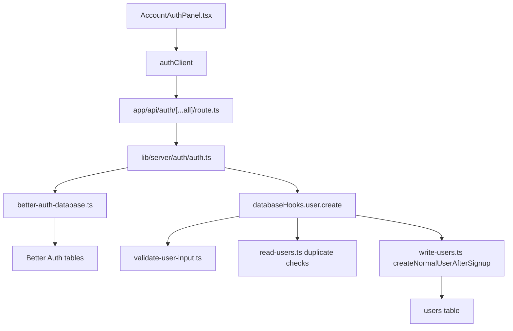

## 10. AccountAuthPanel Course

The account page is browser UI. It does not know how passwords are stored.

### Session Code

```tsx
const session = authClient.useSession();
```

### What This Does

This asks Better Auth:

```text
Is there a currently logged-in user in this browser?
```

The result controls which UI branch renders:

```text
pending      -> Loading
logged in    -> account display and Log Out button
logged out   -> Sign In / Sign Up form
```

### Form State Code

```tsx
const [mode, setMode] = useState<AuthMode>("sign-in");
const [email, setEmail] = useState("");
const [username, setUsername] = useState("");
const [password, setPassword] = useState("");
const [message, setMessage] = useState("");
const [isSubmitting, setIsSubmitting] = useState(false);
```

### What This Does

These values are only temporary UI state.

The password is not stored in your project database by this component.
It is sent to Better Auth when the form submits.

### Submit Code

```tsx
const handleSubmit = async (event: SubmitEvent<HTMLFormElement>) => {
  event.preventDefault();
  setIsSubmitting(true);
  setMessage("");

  try {
    const result =
      mode === "sign-up"
        ? await authClient.signUp.email({
            email,
            password,
            name: username,
          })
        : await authClient.signIn.email({
            email,
            password,
          });

    if (result.error) {
      throw new Error(result.error.message ?? "Authentication failed.");
    }

    setMessage(mode === "sign-up" ? "Account created." : "Signed in.");
    setPassword("");
    await session.refetch();
  } catch (error) {
    setMessage(
      error instanceof Error ? error.message : "Authentication failed.",
    );
  } finally {
    setIsSubmitting(false);
  }
};
```

### What This Does

```tsx
event.preventDefault();
```

Stops the browser from doing a normal page reload.

```tsx
mode === "sign-up" ? ... : ...
```

Chooses between creating an account and logging in.

```tsx
authClient.signUp.email(...)
```

Sends email, password, and username to the Better Auth API route.

```tsx
name: username
```

Better Auth uses `name`; your project treats that value as username.

```tsx
await session.refetch();
```

Refreshes the UI session after auth succeeds.

## 11. Better Auth Client And API Route

### Client Code

```ts
"use client";

import { createAuthClient } from "better-auth/react";

export const authClient = createAuthClient();
```

### What This Does

This creates the browser-side Better Auth client.

The browser can import this file.
The browser cannot import Turso credentials.

### API Route Code

```ts
import { toNextJsHandler } from "better-auth/next-js";
import { auth } from "@/lib/server/auth/auth";

export const { GET, POST, PUT, PATCH, DELETE } = toNextJsHandler(auth);
```

### What This Does

This creates the endpoint:

```text
/api/auth/[...all]
```

Better Auth uses this one route for many auth actions:

```text
sign up
sign in
sign out
session reads
future auth actions
```

The route forwards requests to:

```text
lib/server/auth/auth.ts
```

## 12. Better Auth Server Config

### Core Config Code

```ts
export const auth = betterAuth({
  appName: "Earth In Sound",
  baseURL: appBaseUrl,
  secret: process.env.BETTER_AUTH_SECRET,
  database: {
    db: betterAuthDatabase,
    type: "sqlite",
    casing: "snake",
  },
  emailAndPassword: {
    enabled: true,
    minPasswordLength: 8,
    maxPasswordLength: 128,
    autoSignIn: true,
  },
  plugins: [nextCookies()],
});
```

### What This Does

```ts
secret: process.env.BETTER_AUTH_SECRET
```

Uses a private server secret from `.env.local`.

```ts
database: { db: betterAuthDatabase, type: "sqlite" }
```

Tells Better Auth to store auth data in Turso/libSQL.

```ts
emailAndPassword.enabled = true
```

Turns on email/password login.

```ts
minPasswordLength: 8
maxPasswordLength: 128
```

Sets password length rules.

```ts
nextCookies()
```

Lets Better Auth work correctly with Next.js cookies.

## 13. Signup Hooks

Better Auth creates its own auth user.
Your app also needs a project profile row in `users`.

The hooks connect those two systems.

### Before Hook Code

```ts
before: async (user) => {
  const email = requireValidEmail(user.email);
  const username = requireValidUsername(String(user.name ?? ""));

  if (await getUserByEmail(email)) {
    throw new Error("Email is already registered.");
  }

  if (await getUserByUsername(username)) {
    throw new Error("Username is already registered.");
  }

  return {
    data: {
      ...user,
      email,
      name: username,
    },
  };
},
```

### What This Does

This runs before Better Auth creates the auth user.

```ts
requireValidEmail(user.email)
```

Validates the email format.

```ts
requireValidUsername(String(user.name ?? ""))
```

Validates the username.

```ts
getUserByEmail(email)
getUserByUsername(username)
```

Checks the project `users` table for duplicates.

```ts
throw new Error(...)
```

Stops signup if the account should not be created.

### After Hook Code

```ts
after: async (user) => {
  await createNormalUserAfterSignup({
    authProviderUserId: user.id,
    email: user.email,
    username: String(user.name ?? ""),
  });
},
```

### What This Does

This runs after Better Auth creates its auth user.

It creates the matching Earth In Sound user row:

```text
auth_provider_user_id = Better Auth user.id
role = "user"
status = "active"
```

Public signup cannot create an admin or owner.

## 14. Better Auth Database Connection

### Real Code

```ts
const databaseUrl = process.env.TURSO_DATABASE_URL;
const databaseToken = process.env.TURSO_AUTH_TOKEN;

if (!databaseUrl) {
  throw new Error("Missing TURSO_DATABASE_URL in .env.local.");
}

if (!databaseToken) {
  throw new Error("Missing TURSO_AUTH_TOKEN in .env.local.");
}

export const betterAuthDatabase = new Kysely<Record<string, never>>({
  dialect: new LibsqlDialect({
    url: databaseUrl,
    authToken: databaseToken,
  }),
});
```

### What This Does

Better Auth expects a Kysely database connection.

This file gives Better Auth that connection.

Your own database functions use:

```text
lib/server/database/turso-client.ts
```

Better Auth uses:

```text
lib/server/auth/better-auth-database.ts
```

They point to the same Turso database but serve different code paths.

## 15. Project Users Table

Your `users` table is the application profile table.

It is not the password table.

### User Database Schema

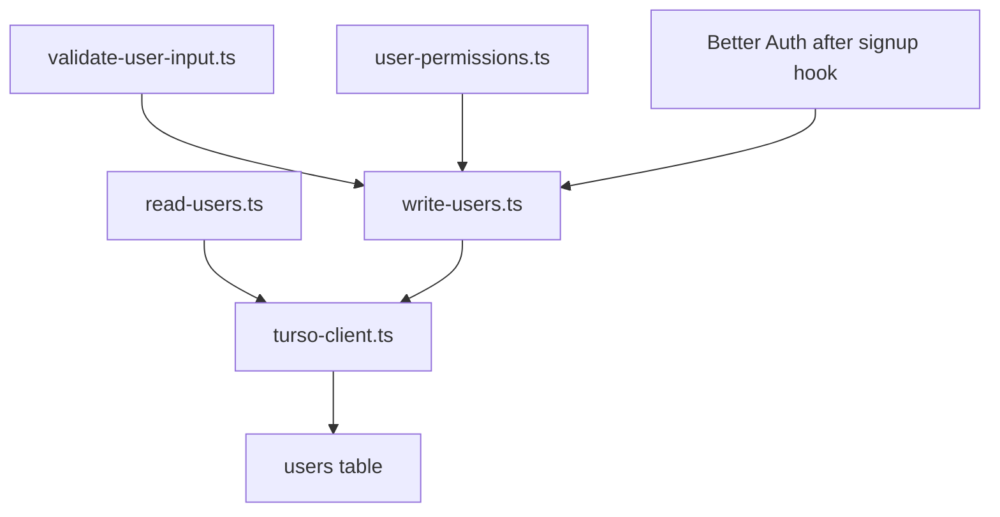

### Turso Client Code

```ts
const tursoDatabaseUrl = process.env.TURSO_DATABASE_URL;
const tursoAuthToken = process.env.TURSO_AUTH_TOKEN;

if (!tursoDatabaseUrl) {
  throw new Error("Missing TURSO_DATABASE_URL in .env.local.");
}

if (!tursoAuthToken) {
  throw new Error("Missing TURSO_AUTH_TOKEN in .env.local.");
}

export const turso = createClient({
  url: tursoDatabaseUrl,
  authToken: tursoAuthToken,
});
```

### What This Does

This is the shared server-side Turso client for Earth In Sound database tables.

Do not import it into browser components.

Safe places:

```text
server files
database scripts
route handlers
server actions later
```

Unsafe places:

```text
client components
browser code
CSS
```

## 16. User Validation

### Email Code

```ts
export function requireValidEmail(email: string): string {
  const cleanedEmail = email.trim();

  if (!cleanedEmail) {
    throw new Error("Email is required.");
  }

  if (/\s/.test(cleanedEmail)) {
    throw new Error("Email cannot contain spaces.");
  }

  if (!/^[^\s@]+@[^\s@]+\.[^\s@]+$/.test(cleanedEmail)) {
    throw new Error("Enter a valid email address.");
  }

  return cleanedEmail;
}
```

### What This Does

```ts
email.trim()
```

Removes accidental spaces at the beginning and end.

```ts
/\s/.test(cleanedEmail)
```

Rejects spaces anywhere inside the email.

```ts
/^[^\s@]+@[^\s@]+\.[^\s@]+$/
```

Requires a basic email shape:

```text
something@something.something
```

This does not prove the mailbox exists.
Email verification should later be handled by the auth provider.

### Username Code

```ts
export function requireValidUsername(username: string): string {
  const cleanedUsername = username.trim();

  if (!cleanedUsername) {
    throw new Error("Username is required.");
  }

  if (cleanedUsername.length < 3 || cleanedUsername.length > 32) {
    throw new Error("Username must be between 3 and 32 characters.");
  }

  if (
    !/^[A-Za-z0-9](?:[A-Za-z0-9]|[-_.](?=[A-Za-z0-9]))*$/.test(cleanedUsername)
  ) {
    throw new Error(
      'Username may use letters, numbers, "-", "_" and ".", but separators cannot touch.',
    );
  }

  return cleanedUsername;
}
```

### What This Does

Allowed username characters:

```text
letters
numbers
-
_
.
```

Not allowed:

```text
.. 
--
__
.- 
username ending in punctuation
username starting with punctuation
```

The regex forces punctuation to be followed by a letter or number.

## 17. Lookup Values

### Real Code

```ts
export function toLookupValue(value: string): string {
  return value.toLowerCase();
}
```

### What This Does

The visible value is preserved:

```text
Andrew
```

The lookup value is lowercase:

```text
andrew
```

That prevents duplicate accounts like:

```text
Andrew
andrew
ANDREW
```

The original casing can still be displayed to the user.

## 18. User Reading Functions

### getUserById Code

```ts
export async function getUserById(userId: string): Promise<StoredUser | null> {
  const cleanedUserId = userId.trim();

  if (!cleanedUserId) {
    throw new Error("User id is required.");
  }

  const result = await turso.execute({
    sql: "SELECT * FROM users WHERE id = ? LIMIT 1",
    args: [cleanedUserId],
  });

  return (result.rows[0] as unknown as StoredUser | undefined) ?? null;
}
```

### What This Does

```ts
SELECT * FROM users WHERE id = ? LIMIT 1
```

Finds one user by internal Earth In Sound user id.

```ts
?
args: [cleanedUserId]
```

This passes the value separately from the SQL string.
That is safer than building SQL with string concatenation.

### getCurrentUser Code

```ts
export async function getCurrentUser(
  input: GetCurrentUserInput,
): Promise<StoredUser | null> {
  const authProviderUserId = input.authProviderUserId?.trim();

  if (!authProviderUserId) {
    return null;
  }

  return getUserByAuthProviderId(authProviderUserId);
}
```

### What This Does

This connects a Better Auth session to your project user row.

Flow:

```text
Better Auth session user.id
  -> auth_provider_user_id
  -> users table row
```

### searchUsers Code

```ts
export async function searchUsers(
  input: SearchUsersInput,
): Promise<StoredUser[]> {
  const cleanedSearchText = input.searchText.trim();

  if (!cleanedSearchText) {
    return [];
  }

  const searchLookup = `%${toLookupValue(cleanedSearchText)}%`;
  const resultLimit = Math.min(Math.max(input.limit ?? 20, 1), 50);

  const result = await turso.execute({
    sql: `
      SELECT *
      FROM users
      WHERE email_lookup LIKE ?
         OR username_lookup LIKE ?
      ORDER BY email_lookup ASC
      LIMIT ?
    `,
    args: [searchLookup, searchLookup, resultLimit],
  });

  return result.rows as unknown as StoredUser[];
}
```

### What This Does

```ts
if (!cleanedSearchText) return [];
```

Prevents accidentally dumping all users.

```ts
%${toLookupValue(cleanedSearchText)}%
```

Allows partial matching.

Example:

```text
"And" can find "Andrew" and "Andreea".
```

```ts
Math.min(Math.max(input.limit ?? 20, 1), 50)
```

Keeps the result limit between 1 and 50.

## 19. User Permission Rules

### Role Rank Code

```ts
export function getRoleRank(role: UserRole): number {
  const roleRanks: Record<UserRole, number> = {
    owner: 3,
    admin: 2,
    user: 1,
  };

  return roleRanks[role];
}
```

### What This Does

Ranks make permissions easy to compare.

```text
owner = 3
admin = 2
user = 1
```

Higher number means more authority.

### Manage Permission Code

```ts
export function requireCanManageUser(
  currentUser: StoredUser,
  targetUser: StoredUser,
): void {
  if (currentUser.id === targetUser.id) {
    return;
  }

  const currentUserRoleRank = getRoleRank(currentUser.role);
  const targetUserRoleRank = getRoleRank(targetUser.role);

  if (currentUserRoleRank <= targetUserRoleRank) {
    throw new Error("You do not have permission to manage this user.");
  }
}
```

### What This Does

Self-management is allowed first:

```ts
if (currentUser.id === targetUser.id) return;
```

For managing another account:

```text
current user rank must be greater than target user rank
```

So:

```text
owner can manage admin and user
admin can manage user
user cannot manage others
admin cannot manage owner
```

## 20. User Write Functions

### createLocalOwner Code

```ts
export async function createLocalOwner(
  input: CreateLocalOwnerInput,
): Promise<string> {
  const email = requireValidEmail(input.email);
  const username = requireValidUsername(input.username);
  const now = Date.now();

  const existingOwner = await turso.execute({
    sql: "SELECT id FROM users WHERE role = 'owner' LIMIT 1",
  });

  if (existingOwner.rows.length > 0) {
    throw new Error("Owner already exists.");
  }

  const ownerId = randomUUID();

  await turso.execute({
    sql: `
      INSERT INTO users (
        id,
        auth_provider_user_id,
        email,
        email_lookup,
        username,
        username_lookup,
        role,
        status,
        created_at,
        updated_at
      )
      VALUES (?, NULL, ?, ?, ?, ?, 'owner', 'active', ?, ?)
    `,
    args: [
      ownerId,
      email,
      toLookupValue(email),
      username,
      toLookupValue(username),
      now,
      now,
    ],
  });

  return ownerId;
}
```

### What This Does

This is a setup-only function.

It creates the first owner.

It is separate from signup because public signup must only create normal users.

### createNormalUserAfterSignup Code

```ts
export async function createNormalUserAfterSignup(
  input: CreateNormalUserAfterSignupInput,
): Promise<StoredUser> {
  const authProviderUserId = input.authProviderUserId.trim();

  if (!authProviderUserId) {
    throw new Error("Auth provider user id is required.");
  }

  const existingAuthUser = await getUserByAuthProviderId(authProviderUserId);

  if (existingAuthUser) {
    return existingAuthUser;
  }

  const email = requireValidEmail(input.email);
  const username = requireValidUsername(input.username);
  const now = Date.now();
  const userId = randomUUID();

  await turso.execute({
    sql: `
      INSERT INTO users (
        id,
        auth_provider_user_id,
        email,
        email_lookup,
        username,
        username_lookup,
        role,
        status,
        created_at,
        updated_at
      )
      VALUES (?, ?, ?, ?, ?, ?, 'user', 'active', ?, ?)
    `,
    args: [
      userId,
      authProviderUserId,
      email,
      toLookupValue(email),
      username,
      toLookupValue(username),
      now,
      now,
    ],
  });

  const createdUser = await getUserById(userId);

  return requireStoredUser(createdUser, "Created user was not found.");
}
```

### What This Does

This creates a project profile after Better Auth signup succeeds.

Important:

```sql
role = 'user'
status = 'active'
```

That is why signup cannot create admins or owners.

### updateUsername Code

```ts
export async function updateUsername(
  input: UpdateUsernameInput,
): Promise<StoredUser> {
  const currentUser = requireActiveUser(
    requireStoredUser(
      await getUserById(input.currentUserId),
      "Current user was not found.",
    ),
  );

  const cleanedUsername = requireValidUsername(input.username);
  const usernameLookup = toLookupValue(cleanedUsername);
  const now = Date.now();

  const existingUsername = await turso.execute({
    sql: "SELECT id FROM users WHERE username_lookup = ? AND id != ? LIMIT 1",
    args: [usernameLookup, currentUser.id],
  });

  if (existingUsername.rows.length > 0) {
    throw new Error("Username is already registered.");
  }

  await turso.execute({
    sql: `
      UPDATE users
      SET username = ?, username_lookup = ?, updated_at = ?
      WHERE id = ?
    `,
    args: [cleanedUsername, usernameLookup, now, currentUser.id],
  });

  const updatedUser = await getUserById(currentUser.id);

  return requireStoredUser(updatedUser, "Updated user was not found.");
}
```

### What This Does

Only the current user can change their own username.

This function does not accept `targetUserId`.

That design prevents:

```text
admin changes another user's username
owner changes another user's username
```

### disableUser Versus deleteUser

```text
disabled:
  account cannot act
  email remains reserved
  username remains reserved
  can be reactivated

deleted:
  soft-deleted for history
  auth link removed
  email lookup released
  cannot be normally reactivated
```

### deleteUser Key Code

```ts
await turso.execute({
  sql: `
    UPDATE users
    SET
      auth_provider_user_id = NULL,
      email_lookup = ?,
      status = 'deleted',
      updated_at = ?
    WHERE id = ?
  `,
  args: [getDeletedEmailLookup(targetUser.id, now), now, targetUser.id],
});
```

### What This Does

```ts
auth_provider_user_id = NULL
```

Disconnects the deleted row from the auth account.

```ts
email_lookup = getDeletedEmailLookup(...)
```

Releases the real email so it can be used again.

```ts
status = 'deleted'
```

Keeps history without allowing the row to act like an active account.

## 21. Ownership And Roles

### transferOwnership Code

```ts
await turso.batch(
  [
    {
      sql: `
        UPDATE users
        SET role = 'admin', updated_at = ?
        WHERE id = ?
      `,
      args: [now, currentOwner.id],
    },
    {
      sql: `
        UPDATE users
        SET role = 'owner', updated_at = ?
        WHERE id = ?
      `,
      args: [now, targetUser.id],
    },
  ],
  "write",
);
```

### What This Does

Ownership is transferred in one batch:

```text
old owner -> admin
target user -> owner
```

That keeps the project in a single-owner model.

### setUserRole Code

```ts
export type AssignableUserRole = Exclude<UserRole, "owner">;

export interface SetUserRoleInput {
  currentOwnerId: string;
  targetUserId: string;
  targetRole: AssignableUserRole;
}
```

### What This Does

`targetRole` cannot be `"owner"`.

That means normal role editing can only set:

```text
admin
user
```

Owner changes must go through `transferOwnership`.

## Auth And Database Deep Dive

This chapter is the slow version of the auth/database system.

Read it as a chain:

```text
browser form
  -> Better Auth browser client
  -> Next.js auth API route
  -> Better Auth server config
  -> Better Auth auth tables
  -> Earth In Sound users table
```

The most important thing to remember is:

```text
Better Auth owns login security.
Earth In Sound owns site identity and permissions.
```

That means passwords do not belong in your project `StoredUser` type. The
project user row stores the public/profile/control data your website needs.
Better Auth stores the private auth data it needs.

### Auth And Database Responsibility Schema

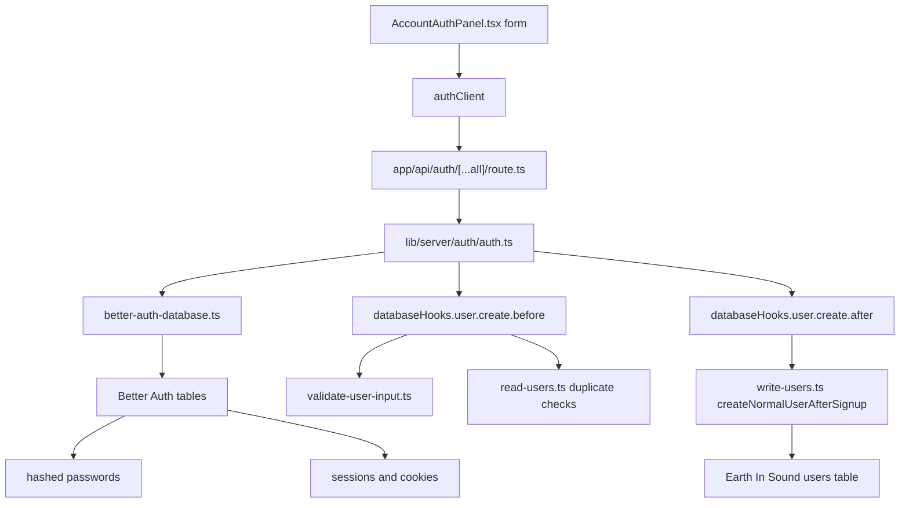

### Why There Are Two User Concepts

Better Auth has an internal auth user.

That auth user answers questions like:

```text
Can this person sign in?
What is the password hash?
What browser session is active?
What cookie identifies this session?
```

Earth In Sound has a project user row.

That project user answers questions like:

```text
What username is shown on the site?
Is this account active, disabled, or deleted?
Is this account owner, admin, or user?
Which Better Auth user does this profile belong to?
```

The bridge between the two worlds is:

```ts
auth_provider_user_id
```

In your project users table, that field stores the Better Auth `user.id`.

```text
Better Auth user.id
  -> users.auth_provider_user_id
  -> Earth In Sound user profile
```

### Why StoredUser Should Not Contain Passwords

The project type is:

```ts
export interface StoredUser {
  id: string;
  auth_provider_user_id: string | null;
  email: string;
  email_lookup: string;
  username: string;
  username_lookup: string;
  role: UserRole;
  status: UserStatus;
  created_at: number;
  updated_at: number;
}
```

This type describes the `users` table controlled by your application.

There is intentionally no:

```ts
password: string;
passwordHash: string;
```

Why?

```text
Your app should not manually store raw passwords.
Your app should not manually compare passwords.
Your app should not expose password hashes through project user reads.
Better Auth owns that security-sensitive layer.
```

When a user signs in, your project asks Better Auth:

```text
Is this login valid?
```

It does not ask the project `users` table:

```text
Does this password match?
```

That separation is cleaner and safer.

### Signup Flow With Real Function Names

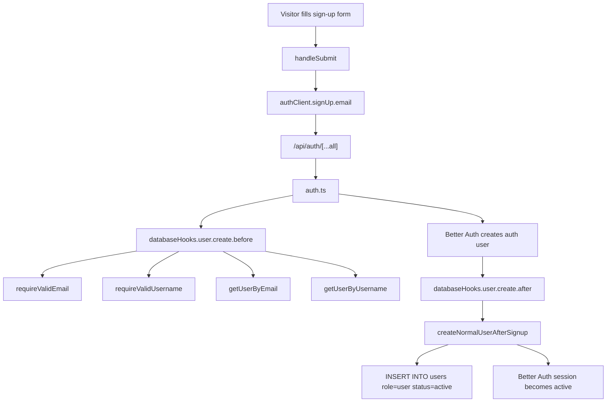

### AccountAuthPanel Submit Code

File:

```text
features/account-auth/AccountAuthPanel.tsx
```

Code:

```tsx
const handleSubmit = async (event: SubmitEvent<HTMLFormElement>) => {
  event.preventDefault();
  setIsSubmitting(true);
  setMessage("");

  try {
    const result =
      mode === "sign-up"
        ? await authClient.signUp.email({
            email,
            password,
            name: username,
          })
        : await authClient.signIn.email({
            email,
            password,
          });

    if (result.error) {
      throw new Error(result.error.message ?? "Authentication failed.");
    }

    setMessage(mode === "sign-up" ? "Account created." : "Signed in.");
    setPassword("");
    await session.refetch();
  } catch (error) {
    setMessage(
      error instanceof Error ? error.message : "Authentication failed.",
    );
  } finally {
    setIsSubmitting(false);
  }
};
```

### Submit Code Line By Line

```tsx
event.preventDefault();
```

Stops the browser from doing a normal HTML form submission.

Without this line, the page could reload before React finishes the auth request.

```tsx
setIsSubmitting(true);
setMessage("");
```

Puts the form into a busy state and clears the old message.

This lets the button become disabled while the request is running.

```tsx
mode === "sign-up"
```

Chooses between two actions:

```text
sign-up: create a new account
sign-in: log into an existing account
```

```tsx
authClient.signUp.email({
  email,
  password,
  name: username,
})
```

Sends the signup request to Better Auth.

Important detail:

```tsx
name: username
```

Better Auth uses `name` as its user display field.
Your project treats that same submitted value as the Earth In Sound username.

```tsx
authClient.signIn.email({
  email,
  password,
})
```

Sends a login request.

This does not create a project user row. It only asks Better Auth to verify the
credentials and restore/create a session.

```tsx
if (result.error) {
  throw new Error(result.error.message ?? "Authentication failed.");
}
```

Better Auth returns an error object when the request fails.

Throwing it moves execution into the `catch` block, where the UI message is set.

```tsx
setPassword("");
```

Clears the password input after a successful auth action.

The password should not remain visible in React state longer than needed.

```tsx
await session.refetch();
```

Asks Better Auth for the newest session state.

This is why the UI can immediately change from the form to the logged-in view.

```tsx
finally {
  setIsSubmitting(false);
}
```

Runs whether the request succeeded or failed.

It releases the form from the busy state.

### Browser Auth Client

File:

```text
lib/client/auth/auth-client.ts
```

Code:

```ts
"use client";

import { createAuthClient } from "better-auth/react";

export const authClient = createAuthClient();
```

### What This File Really Is

This file creates the browser-side Better Auth controller.

React components use it for:

```text
authClient.signUp.email(...)
authClient.signIn.email(...)
authClient.signOut()
authClient.useSession()
```

It does not contain:

```text
TURSO_DATABASE_URL
TURSO_AUTH_TOKEN
BETTER_AUTH_SECRET
password hashing code
SQL code
```

That is intentional.

Client files run in the browser. Browser files must not have database secrets.

### Auth API Route

File:

```text
app/api/auth/[...all]/route.ts
```

Code:

```ts
import { toNextJsHandler } from "better-auth/next-js";
import { auth } from "@/lib/server/auth/auth";

export const { GET, POST, PUT, PATCH, DELETE } = toNextJsHandler(auth);
```

### What This Route Does

The route is the server doorway for Better Auth.

When the browser calls:

```tsx
authClient.signUp.email(...)
```

Better Auth sends an HTTP request to this route.

This line:

```ts
toNextJsHandler(auth)
```

turns the Better Auth server config into Next.js route handlers.

The exports:

```ts
GET, POST, PUT, PATCH, DELETE
```

mean Better Auth can handle several HTTP methods through the same catch-all
route.

### Better Auth Server Config

File:

```text
lib/server/auth/auth.ts
```

Core code:

```ts
export const auth = betterAuth({
  appName: "Earth In Sound",
  baseURL: appBaseUrl,
  secret: process.env.BETTER_AUTH_SECRET,
  database: {
    db: betterAuthDatabase,
    type: "sqlite",
    casing: "snake",
  },
  emailAndPassword: {
    enabled: true,
    minPasswordLength: 8,
    maxPasswordLength: 128,
    autoSignIn: true,
  },
  databaseHooks: {
    user: {
      create: {
        before: async (user) => {
          // validation and duplicate checks
        },
        after: async (user) => {
          // project user creation
        },
      },
    },
  },
  plugins: [nextCookies()],
});
```

### Better Auth Config Piece By Piece

```ts
appName: "Earth In Sound",
```

Names the application inside Better Auth.

```ts
baseURL: appBaseUrl,
```

Tells Better Auth what the site URL is.

Locally it falls back to:

```text
http://localhost:3000
```

```ts
secret: process.env.BETTER_AUTH_SECRET,
```

Secret used by Better Auth for secure auth operations.

This must stay in `.env.local` or host environment variables.

```ts
database: {
  db: betterAuthDatabase,
  type: "sqlite",
  casing: "snake",
}
```

Tells Better Auth:

```text
Use Turso/libSQL through the Kysely connection.
Use SQLite-compatible behavior.
Use snake_case column names.
```

```ts
emailAndPassword: {
  enabled: true,
  minPasswordLength: 8,
  maxPasswordLength: 128,
  autoSignIn: true,
}
```

Enables email/password accounts.

The password length rules are enforced by Better Auth.

```ts
autoSignIn: true
```

After signup succeeds, Better Auth signs the new user in automatically.

### Signup Before Hook

Code:

```ts
before: async (user) => {
  const email = requireValidEmail(user.email);
  const username = requireValidUsername(String(user.name ?? ""));

  if (await getUserByEmail(email)) {
    throw new Error("Email is already registered.");
  }

  if (await getUserByUsername(username)) {
    throw new Error("Username is already registered.");
  }

  return {
    data: {
      ...user,
      email,
      name: username,
    },
  };
},
```

### Before Hook Line By Line

```ts
before: async (user) => {
```

This runs before Better Auth creates its internal auth user.

If this function throws an error, signup stops.

```ts
const email = requireValidEmail(user.email);
```

Validates the email format and returns the cleaned email.

The visible email casing is preserved.

```ts
const username = requireValidUsername(String(user.name ?? ""));
```

Better Auth receives the submitted username as `user.name`.

`String(user.name ?? "")` makes sure the validator always receives a string.

If no username exists, the validator receives an empty string and throws:

```text
Username is required.
```

```ts
if (await getUserByEmail(email)) {
  throw new Error("Email is already registered.");
}
```

Checks the project `users` table for an existing email.

This uses `email_lookup`, so the check is case-insensitive.

```ts
if (await getUserByUsername(username)) {
  throw new Error("Username is already registered.");
}
```

Checks for an existing username.

This uses `username_lookup`, so `Bucketb0t` and `bucketb0t` cannot become two
separate accounts.

```ts
return {
  data: {
    ...user,
    email,
    name: username,
  },
};
```

Returns the cleaned values to Better Auth.

Better Auth then continues with these validated values.

### Signup After Hook

Code:

```ts
after: async (user) => {
  await createNormalUserAfterSignup({
    authProviderUserId: user.id,
    email: user.email,
    username: String(user.name ?? ""),
  });
},
```

### After Hook Line By Line

```ts
after: async (user) => {
```

This runs after Better Auth has successfully created its auth user.

At this point, Better Auth already has:

```text
auth user id
email
password hash
session data if autoSignIn succeeds
```

```ts
authProviderUserId: user.id,
```

This is the Better Auth user id.

Your project stores it in:

```text
users.auth_provider_user_id
```

```ts
email: user.email,
username: String(user.name ?? ""),
```

These are passed to the project database function.

```ts
await createNormalUserAfterSignup(...)
```

Creates the Earth In Sound user row.

This is the function that makes the normal project profile after signup.

### Better Auth Database Connection

File:

```text
lib/server/auth/better-auth-database.ts
```

Code:

```ts
const databaseUrl = process.env.TURSO_DATABASE_URL;
const databaseToken = process.env.TURSO_AUTH_TOKEN;

if (!databaseUrl) {
  throw new Error("Missing TURSO_DATABASE_URL in .env.local.");
}

if (!databaseToken) {
  throw new Error("Missing TURSO_AUTH_TOKEN in .env.local.");
}

export const betterAuthDatabase = new Kysely<Record<string, never>>({
  dialect: new LibsqlDialect({
    url: databaseUrl,
    authToken: databaseToken,
  }),
});
```

### What This Connection Does

Better Auth expects a Kysely-style database object.

Turso uses libSQL.

This file connects those two worlds:

```text
Better Auth
  -> Kysely
  -> LibsqlDialect
  -> Turso
```

This connection is for Better Auth's own tables.

The project user functions use a different Turso client because they execute
plain SQL directly.

### Project Turso Client

File:

```text
lib/server/database/turso-client.ts
```

Code:

```ts
const tursoDatabaseUrl = process.env.TURSO_DATABASE_URL;
const tursoAuthToken = process.env.TURSO_AUTH_TOKEN;

if (!tursoDatabaseUrl) {
  throw new Error("Missing TURSO_DATABASE_URL in .env.local.");
}

if (!tursoAuthToken) {
  throw new Error("Missing TURSO_AUTH_TOKEN in .env.local.");
}

export const turso = createClient({
  url: tursoDatabaseUrl,
  authToken: tursoAuthToken,
});
```

### Why This Is Separate From betterAuthDatabase

Both connections point to the same Turso database, but they serve different
callers.

```text
better-auth-database.ts:
  Used by Better Auth internals.
  Uses Kysely because Better Auth expects it.

turso-client.ts:
  Used by Earth In Sound database functions.
  Uses @libsql/client directly.
```

This separation prevents confusion:

```text
Auth internals live in Better Auth tables.
Project rules live in Earth In Sound users table.
```

### The Users Table Purpose

Your project user table stores the site-level identity.

It is the table that future admin pages will read/write.

Important fields:

```text
id:
  Earth In Sound user id.

auth_provider_user_id:
  Better Auth user.id.
  This links auth login to project profile.

email:
  Original visible email value.

email_lookup:
  Lowercase search/uniqueness value.

username:
  Original visible username.

username_lookup:
  Lowercase search/uniqueness value.

role:
  owner, admin, or user.

status:
  active, disabled, or deleted.

created_at:
  Creation timestamp.

updated_at:
  Last change timestamp.
```

### Why Lookup Fields Exist

Example:

```text
Visible email:
  Bucketb0t@Yahoo.com

Lookup email:
  bucketb0t@yahoo.com
```

The visible field keeps what the user typed.

The lookup field lets the database compare values consistently.

That prevents:

```text
bucketb0t@yahoo.com
Bucketb0t@yahoo.com
BUCKETB0T@yahoo.com
```

from becoming three separate accounts.

### Email Validation Course

Code:

```ts
export function requireValidEmail(email: string): string {
  const cleanedEmail = email.trim();

  if (!cleanedEmail) {
    throw new Error("Email is required.");
  }

  if (/\s/.test(cleanedEmail)) {
    throw new Error("Email cannot contain spaces.");
  }

  if (!/^[^\s@]+@[^\s@]+\.[^\s@]+$/.test(cleanedEmail)) {
    throw new Error("Enter a valid email address.");
  }

  return cleanedEmail;
}
```

Line by line:

```ts
const cleanedEmail = email.trim();
```

Removes accidental spaces at the start and end.

```ts
if (!cleanedEmail)
```

Rejects empty input.

```ts
/\s/.test(cleanedEmail)
```

Checks for any whitespace character anywhere in the email.

That catches:

```text
name @domain.com
name@domain .com
name@ domain.com
```

```ts
/^[^\s@]+@[^\s@]+\.[^\s@]+$/.test(cleanedEmail)
```

Checks for the simple structure:

```text
text@text.text
```

This does not prove that the mailbox exists.

Later, Better Auth email verification should prove ownership by sending a real
email.

### Username Validation Course

Code:

```ts
export function requireValidUsername(username: string): string {
  const cleanedUsername = username.trim();

  if (!cleanedUsername) {
    throw new Error("Username is required.");
  }

  if (cleanedUsername.length < 3 || cleanedUsername.length > 32) {
    throw new Error("Username must be between 3 and 32 characters.");
  }

  if (
    !/^[A-Za-z0-9](?:[A-Za-z0-9]|[-_.](?=[A-Za-z0-9]))*$/.test(cleanedUsername)
  ) {
    throw new Error(
      'Username may use letters, numbers, "-", "_" and ".", but separators cannot touch.',
    );
  }

  return cleanedUsername;
}
```

Line by line:

```ts
const cleanedUsername = username.trim();
```

Keeps the username as typed except for accidental edge spaces.

```ts
cleanedUsername.length < 3 || cleanedUsername.length > 32
```

Rejects usernames that are too short or too long.

```ts
/^[A-Za-z0-9](?:[A-Za-z0-9]|[-_.](?=[A-Za-z0-9]))*$/
```

This regex means:

```text
must start with a letter or number
may contain letters or numbers
may contain "-", "_" or "."
special separators must be followed by a letter or number
```

Allowed:

```text
Bucketb0t
jason_walton
i-hate.music
name_01
```

Rejected:

```text
_name
name_
name..test
name--test
...
```

### Read Function Pattern

Most read functions follow this pattern:

```text
clean input
validate if needed
run SELECT
return StoredUser or null
```

Example:

```ts
export async function getUserByEmail(
  email: string,
): Promise<StoredUser | null> {
  const cleanedEmail = requireValidEmail(email);

  const result = await turso.execute({
    sql: "SELECT * FROM users WHERE email_lookup = ? LIMIT 1",
    args: [toLookupValue(cleanedEmail)],
  });

  return (result.rows[0] as unknown as StoredUser | undefined) ?? null;
}
```

Line by line:

```ts
const cleanedEmail = requireValidEmail(email);
```

Bad email input stops here before a SQL query is made.

```ts
sql: "SELECT * FROM users WHERE email_lookup = ? LIMIT 1",
```

Asks Turso for one matching row.

```ts
args: [toLookupValue(cleanedEmail)]
```

Uses a parameter instead of manually building a SQL string.

This is important because it helps avoid SQL injection.

```ts
result.rows[0]
```

Reads the first matching row.

```ts
?? null
```

If no row exists, the function returns `null`.

### getCurrentUser Course

Code:

```ts
export async function getCurrentUser(
  input: GetCurrentUserInput,
): Promise<StoredUser | null> {
  const authProviderUserId = input.authProviderUserId?.trim();

  if (!authProviderUserId) {
    return null;
  }

  return getUserByAuthProviderId(authProviderUserId);
}
```

What it means:

```ts
input.authProviderUserId?.trim()
```

Takes the Better Auth user id if it exists.

The `?.` means:

```text
If authProviderUserId is null or undefined, do not crash.
```

```ts
if (!authProviderUserId) {
  return null;
}
```

If there is no logged-in auth id, there is no current project user.

```ts
return getUserByAuthProviderId(authProviderUserId);
```

Loads the Earth In Sound profile that belongs to the Better Auth account.

Future server pages can use this pattern:

```text
read Better Auth session
take session.user.id
call getCurrentUser({ authProviderUserId: session.user.id })
```

### Search Users Course

Code:

```ts
export async function searchUsers(
  input: SearchUsersInput,
): Promise<StoredUser[]> {
  const cleanedSearchText = input.searchText.trim();

  if (!cleanedSearchText) {
    return [];
  }

  const searchLookup = `%${toLookupValue(cleanedSearchText)}%`;
  const resultLimit = Math.min(Math.max(input.limit ?? 20, 1), 50);

  const result = await turso.execute({
    sql: `
      SELECT *
      FROM users
      WHERE email_lookup LIKE ?
         OR username_lookup LIKE ?
      ORDER BY email_lookup ASC
      LIMIT ?
    `,
    args: [searchLookup, searchLookup, resultLimit],
  });

  return result.rows as unknown as StoredUser[];
}
```

Line by line:

```ts
const cleanedSearchText = input.searchText.trim();
```

Removes accidental outer spaces from the search.

```ts
if (!cleanedSearchText) {
  return [];
}
```

An empty search returns no users.

This avoids accidentally listing the whole user table.

```ts
const searchLookup = `%${toLookupValue(cleanedSearchText)}%`;
```

Creates a SQL `LIKE` pattern.

Example:

```text
input: and
lookup: %and%
```

That can match:

```text
andrew
andreea
andy
bucket-andrew
```

```ts
const resultLimit = Math.min(Math.max(input.limit ?? 20, 1), 50);
```

This clamps the requested result count:

```text
missing limit -> 20
less than 1  -> 1
more than 50 -> 50
```

So no caller can request unlimited users.

```sql
WHERE email_lookup LIKE ?
   OR username_lookup LIKE ?
```

Searches both email and username lookup fields.

### Write Function Pattern

Most write functions follow this pattern:

```text
load current user
require current user exists
require current user is active
load target user if needed
validate input
check permission
run INSERT or UPDATE
read the changed row back
return the changed row
```

This is intentionally repetitive.

Repetition here is useful because each function clearly shows its safety gates.

### createNormalUserAfterSignup Course

Code:

```ts
export async function createNormalUserAfterSignup(
  input: CreateNormalUserAfterSignupInput,
): Promise<StoredUser> {
  const authProviderUserId = input.authProviderUserId.trim();

  if (!authProviderUserId) {
    throw new Error("Auth provider user id is required.");
  }

  const existingAuthUser = await getUserByAuthProviderId(authProviderUserId);

  if (existingAuthUser) {
    return existingAuthUser;
  }

  const email = requireValidEmail(input.email);
  const username = requireValidUsername(input.username);
  const now = Date.now();

  const existingEmail = await turso.execute({
    sql: "SELECT id FROM users WHERE email_lookup = ? LIMIT 1",
    args: [toLookupValue(email)],
  });

  if (existingEmail.rows.length > 0) {
    throw new Error("Email is already registered.");
  }

  const existingUsername = await turso.execute({
    sql: "SELECT id FROM users WHERE username_lookup = ? LIMIT 1",
    args: [toLookupValue(username)],
  });

  if (existingUsername.rows.length > 0) {
    throw new Error("Username is already registered.");
  }

  const userId = randomUUID();

  await turso.execute({
    sql: `
      INSERT INTO users (
        id,
        auth_provider_user_id,
        email,
        email_lookup,
        username,
        username_lookup,
        role,
        status,
        created_at,
        updated_at
      )
      VALUES (?, ?, ?, ?, ?, ?, 'user', 'active', ?, ?)
    `,
    args: [
      userId,
      authProviderUserId,
      email,
      toLookupValue(email),
      username,
      toLookupValue(username),
      now,
      now,
    ],
  });

  const createdUser = await getUserById(userId);

  return requireStoredUser(createdUser, "Created user was not found.");
}
```

### createNormalUserAfterSignup Line By Line

```ts
const authProviderUserId = input.authProviderUserId.trim();
```

Gets the Better Auth user id and removes edge spaces.

```ts
if (!authProviderUserId)
```

Signup mirroring cannot happen without the Better Auth id.

```ts
const existingAuthUser = await getUserByAuthProviderId(authProviderUserId);
```

Checks if the hook already created this project user.

```ts
if (existingAuthUser) {
  return existingAuthUser;
}
```

This is an idempotency guard.

If Better Auth retries the hook, your app avoids creating a duplicate row.

```ts
const email = requireValidEmail(input.email);
const username = requireValidUsername(input.username);
```

Validates again at the write boundary.

Even though the `before` hook already validates, this function protects itself.

```ts
const now = Date.now();
```

Creates one timestamp used for both `created_at` and `updated_at`.

```sql
SELECT id FROM users WHERE email_lookup = ? LIMIT 1
```

Checks whether the email is already reserved by an active or disabled account.

```sql
SELECT id FROM users WHERE username_lookup = ? LIMIT 1
```

Checks whether the username is already reserved.

```ts
const userId = randomUUID();
```

Creates the Earth In Sound user id.

This id is separate from Better Auth's user id.

```sql
VALUES (?, ?, ?, ?, ?, ?, 'user', 'active', ?, ?)
```

This is one of the most important lines:

```text
role is hardcoded to user
status is hardcoded to active
```

Public signup cannot choose `admin` or `owner`.

### updateUsername Course

Code:

```ts
export async function updateUsername(
  input: UpdateUsernameInput,
): Promise<StoredUser> {
  const currentUser = requireActiveUser(
    requireStoredUser(
      await getUserById(input.currentUserId),
      "Current user was not found.",
    ),
  );

  const cleanedUsername = requireValidUsername(input.username);
  const usernameLookup = toLookupValue(cleanedUsername);
  const now = Date.now();

  const existingUsername = await turso.execute({
    sql: "SELECT id FROM users WHERE username_lookup = ? AND id != ? LIMIT 1",
    args: [usernameLookup, currentUser.id],
  });

  if (existingUsername.rows.length > 0) {
    throw new Error("Username is already registered.");
  }

  await turso.execute({
    sql: `
      UPDATE users
      SET username = ?, username_lookup = ?, updated_at = ?
      WHERE id = ?
    `,
    args: [cleanedUsername, usernameLookup, now, currentUser.id],
  });

  const updatedUser = await getUserById(currentUser.id);

  return requireStoredUser(updatedUser, "Updated user was not found.");
}
```

Important design choice:

```text
There is no targetUserId.
```

That means owner/admin cannot use this function to rename someone else.

The function only updates:

```ts
currentUser.id
```

### Permission Course

File:

```text
lib/server/database/users/permissions/user-permissions.ts
```

Code:

```ts
export function requireActiveUser(user: StoredUser): StoredUser {
  if (user.status !== "active") {
    throw new Error("User account is not active.");
  }

  return user;
}
```

This guard blocks disabled or deleted users from performing account actions.

Code:

```ts
export function getRoleRank(role: UserRole): number {
  const roleRanks: Record<UserRole, number> = {
    owner: 3,
    admin: 2,
    user: 1,
  };

  return roleRanks[role];
}
```

This converts roles into numbers.

That makes comparison simple:

```text
owner = 3
admin = 2
user = 1
```

Code:

```ts
export function requireCanManageUser(
  currentUser: StoredUser,
  targetUser: StoredUser,
): void {
  if (currentUser.id === targetUser.id) {
    return;
  }

  const currentUserRoleRank = getRoleRank(currentUser.role);
  const targetUserRoleRank = getRoleRank(targetUser.role);

  if (currentUserRoleRank <= targetUserRoleRank) {
    throw new Error("You do not have permission to manage this user.");
  }
}
```

Line by line:

```ts
if (currentUser.id === targetUser.id) {
  return;
}
```

Users can manage allowed actions on themselves.

But individual write functions can add stricter rules, like:

```text
owner cannot delete itself before ownership transfer
```

```ts
currentUserRoleRank <= targetUserRoleRank
```

If the current user is equal or lower rank, the action is blocked.

So:

```text
admin can manage user
admin cannot manage admin
admin cannot manage owner
owner can manage admin
owner can manage user
```

### Disabled Versus Deleted Course

Disabled and deleted are intentionally different.

```text
disabled:
  account is blocked/inactive
  email stays reserved
  username stays reserved
  account can be reactivated

deleted:
  account is closed
  row stays for history
  auth link is removed
  email lookup is released
  normal reactivation is not allowed
```

### disableUser Code

```ts
await turso.execute({
  sql: `
    UPDATE users
    SET status = 'disabled', updated_at = ?
    WHERE id = ?
  `,
  args: [now, targetUser.id],
});
```

This only changes:

```text
status
updated_at
```

It does not change:

```text
email_lookup
username_lookup
auth_provider_user_id
```

That means the identity stays reserved.

### deleteUser Code

```ts
await turso.execute({
  sql: `
    UPDATE users
    SET
      auth_provider_user_id = NULL,
      email_lookup = ?,
      status = 'deleted',
      updated_at = ?
    WHERE id = ?
  `,
  args: [getDeletedEmailLookup(targetUser.id, now), now, targetUser.id],
});
```

This changes more than disable.

```ts
auth_provider_user_id = NULL
```

Disconnects the project row from Better Auth.

```ts
email_lookup = getDeletedEmailLookup(targetUser.id, now)
```

Releases the original email lookup.

That lets the same email be used again by a future account.

```ts
status = 'deleted'
```

Marks the row as closed/history.

### reactivateUser Code

```ts
if (targetUser.status !== "disabled") {
  throw new Error("Only disabled users can be reactivated.");
}
```

This is the rule that separates disabled from deleted.

Only disabled accounts can return through normal reactivation.

Deleted accounts are not reactivated because their auth link and email lookup
were released.

### Owner Setup And Transfer

Owner creation is separate from public signup.

Code:

```ts
export async function createLocalOwner(
  input: CreateLocalOwnerInput,
): Promise<string> {
  const email = requireValidEmail(input.email);
  const username = requireValidUsername(input.username);
  const now = Date.now();

  const existingOwner = await turso.execute({
    sql: "SELECT id FROM users WHERE role = 'owner' LIMIT 1",
  });

  if (existingOwner.rows.length > 0) {
    throw new Error("Owner already exists.");
  }

  const ownerId = randomUUID();

  await turso.execute({
    sql: `
      INSERT INTO users (
        id,
        auth_provider_user_id,
        email,
        email_lookup,
        username,
        username_lookup,
        role,
        status,
        created_at,
        updated_at
      )
      VALUES (?, NULL, ?, ?, ?, ?, 'owner', 'active', ?, ?)
    `,
    args: [
      ownerId,
      email,
      toLookupValue(email),
      username,
      toLookupValue(username),
      now,
      now,
    ],
  });

  return ownerId;
}
```

Important:

```sql
VALUES (?, NULL, ?, ?, ?, ?, 'owner', 'active', ?, ?)
```

The owner starts without:

```text
auth_provider_user_id
```

because this setup script creates the project role row, not a Better Auth login.

Later you can connect the owner to an auth account or use a controlled transfer.

### Why Public Signup Cannot Create Owner Or Admin

Public signup goes through:

```ts
createNormalUserAfterSignup(...)
```

That function inserts:

```sql
'user', 'active'
```

There is no public signup input for role.

This is good.

Never let a browser form submit:

```text
role = owner
role = admin
```

### setUserRole Course

Code:

```ts
export type AssignableUserRole = Exclude<UserRole, "owner">;

export interface SetUserRoleInput {
  currentOwnerId: string;
  targetUserId: string;
  targetRole: AssignableUserRole;
}
```

This is TypeScript protecting your role model.

```ts
Exclude<UserRole, "owner">
```

means:

```text
take "owner" | "admin" | "user"
remove "owner"
result: "admin" | "user"
```

So `setUserRole` cannot assign owner.

Owner transfer has its own function.

Code:

```ts
if (currentOwner.role !== "owner") {
  throw new Error("Only the owner can change user roles.");
}
```

Only the owner can promote/demote.

Code:

```ts
if (targetUser.role === "owner") {
  throw new Error("Use ownership transfer to change the owner.");
}
```

The current owner cannot demote the owner through this function.

Owner changes go through `transferOwnership`.

### transferOwnership Course

Code:

```ts
await turso.batch(
  [
    {
      sql: `
        UPDATE users
        SET role = 'admin', updated_at = ?
        WHERE id = ?
      `,
      args: [now, currentOwner.id],
    },
    {
      sql: `
        UPDATE users
        SET role = 'owner', updated_at = ?
        WHERE id = ?
      `,
      args: [now, targetUser.id],
    },
  ],
  "write",
);
```

This runs two updates as one write batch:

```text
1. old owner becomes admin
2. target user becomes owner
```

The purpose is to keep the project in a single-owner state.

### Database Action Safety Checklist

When you add future database functions, use this checklist:

```text
1. Is this function server-only?
2. Does it validate all user input?
3. Does it load the current user?
4. Does it verify current user is active?
5. Does it check role permission?
6. Does it avoid trusting browser-submitted role/status?
7. Does it use SQL args instead of string-building SQL?
8. Does it read the changed row back after writing?
9. Does it return a typed result?
10. Is it covered by a test script?
```

### Future Admin Panel Flow

The owner/admin UI should not directly write SQL.

It should call small server functions.

Future flow:

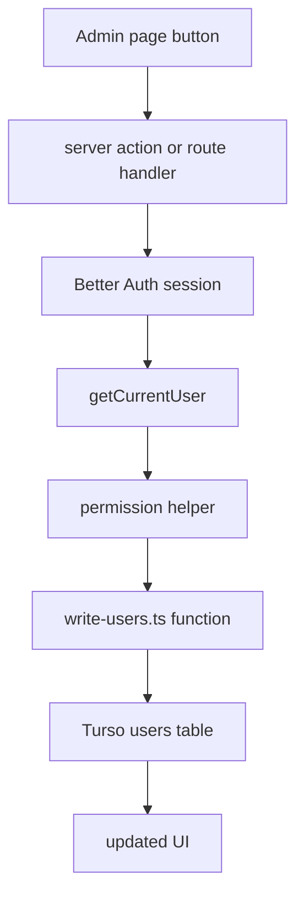

Example:

```text
Admin clicks Disable User.
Server reads session.
Server gets current project user.
Server calls disableUser({ currentUserId, targetUserId }).
disableUser checks status and permission.
disableUser updates Turso.
UI refreshes the user list.
```

### Common Auth/Database Questions

Question:

```text
Where is the password?
```

Answer:

```text
In Better Auth tables, hashed by Better Auth.
Not in StoredUser.
Not in the project users table.
```

Question:

```text
Why do we need auth_provider_user_id?
```

Answer:

```text
Better Auth has its own user id.
Earth In Sound has its own user id.
auth_provider_user_id links them.
```

Question:

```text
Can signup create an admin?
```

Answer:

```text
No.
Signup only calls createNormalUserAfterSignup.
That function hardcodes role = 'user'.
```

Question:

```text
Can admins create users?
```

Answer:

```text
No.
Users create themselves through signup.
Admins manage allowed account states later.
```

Question:

```text
Can a deleted email be reused?
```

Answer:

```text
Yes.
deleteUser replaces email_lookup with deleted-email:<id>:<time>.
The original email_lookup becomes available.
```

Question:

```text
Can a disabled email be reused?
```

Answer:

```text
No.
disabled keeps email_lookup and username_lookup reserved.
```

Question:

```text
Why are SQL args written separately?
```

Answer:

```ts
turso.execute({
  sql: "SELECT * FROM users WHERE email_lookup = ? LIMIT 1",
  args: [emailLookup],
});
```

The `?` placeholder keeps user input separate from SQL text.

This is safer than building SQL manually like:

```ts
// Do not do this.
`SELECT * FROM users WHERE email_lookup = '${emailLookup}'`
```

### The Short Auth/Database Story

```text
AccountAuthPanel collects input.
authClient sends it to Better Auth.
Better Auth route keeps secrets on the server.
auth.ts validates signup through hooks.
Better Auth stores password/session data.
createNormalUserAfterSignup stores the project profile.
read-users.ts loads project users.
write-users.ts changes project users.
user-permissions.ts guards who can do what.
validate-user-input.ts guards input shape.
turso-client.ts is the project database doorway.
```

## 22. Podcast RSS Flow

The podcast route fetches Acast RSS on the server.

### Podcast Schema

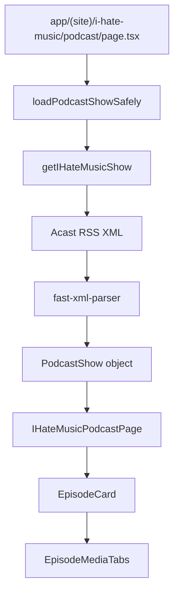

### Route Code

```tsx
export const revalidate = 3600;

export default async function PodcastPage() {
  const show = await loadPodcastShowSafely();
  return <IHateMusicPodcastPage show={show} />;
}

async function loadPodcastShowSafely(): Promise<PodcastShow | null> {
  try {
    return await getIHateMusicShow();
  } catch (error) {
    console.error(error);
    return null;
  }
}
```

### What This Does

```ts
revalidate = 3600
```

Lets Next.js refresh the RSS data hourly.

```ts
loadPodcastShowSafely()
```

Prevents the whole page from crashing if Acast is temporarily unavailable.

## 23. Acast RSS Parser

### Fetch Code

```ts
export async function getIHateMusicShow(): Promise<PodcastShow> {
  const response = await fetch(I_HATE_MUSIC_ACAST_FEED_URL, {
    next: { revalidate: PODCAST_FEED_REVALIDATE_SECONDS },
  });

  if (!response.ok) {
    throw new Error("Unable to load the I Hate Music Acast feed.");
  }

  const xml = await response.text();
```

### What This Does

The server fetches the public RSS feed.

The browser receives clean React data, not raw XML.

### Parser Code

```ts
const parser = new XMLParser({
  attributeNamePrefix: "@_",
  ignoreAttributes: false,
  textNodeName: "#text",
});

const feed = parser.parse(xml) as AcastRssFeed;
const channel = feed.rss?.channel;
```

### What This Does

The parser keeps RSS attributes.

That matters because the audio URL lives here:

```xml
<enclosure url="..." type="audio/mpeg" />
```

After parsing, that becomes:

```ts
episode.enclosure?.["@_url"]
episode.enclosure?.["@_type"]
```

### Episode Mapping Code

```ts
const episodes = asArray(channel.item).map(mapEpisode);

return {
  title: channel.title ?? "I Hate Music",
  subtitle: channel["itunes:subtitle"] ?? "",
  summary: cleanAcastText(
    channel["itunes:summary"] ?? channel.description ?? "",
  ),
  author: channel["itunes:author"] ?? "",
  language: channel.language ?? "",
  imageUrl: cleanTextOrNull(channel.image?.url),
  acastEpisodesUrl: I_HATE_MUSIC_ACAST_EPISODES_URL,
  feedUrl: I_HATE_MUSIC_ACAST_FEED_URL,
  episodes,
};
```

### What This Does

This returns one clean `PodcastShow` object.

React components can render it without understanding RSS.

## 24. Podcast Page Rendering

### Page Code

```tsx
export default function IHateMusicPodcastPage({
  show,
}: IHateMusicPodcastPageProps) {
  return (
    <main className={styles.page}>
      {show ? <PodcastContent show={show} /> : <PodcastUnavailable />}
    </main>
  );
}
```

### What This Does

If RSS loaded:

```tsx
<PodcastContent show={show} />
```

If RSS failed:

```tsx
<PodcastUnavailable />
```

### Episode Split Code

```tsx
const [latestEpisode, ...archiveEpisodes] = show.episodes;
```

### What This Does

Acast returns newest-first.

So:

```text
latestEpisode = newest episode
archiveEpisodes = all remaining episodes
```

### Episode Card Media Code

```tsx
<EpisodeMediaTabs
  episodeId={episode.id}
  audioMimeType={episode.audioMimeType}
  audioUrl={episode.audioUrl}
/>
```

### What This Does

Each episode card gets its own audio/video controls.

The media tabs receive only what they need:

```text
episodeId
audioMimeType
audioUrl
```

## 25. Episode Media Tabs

This is the most interactive podcast component.

### Media Tab Schema

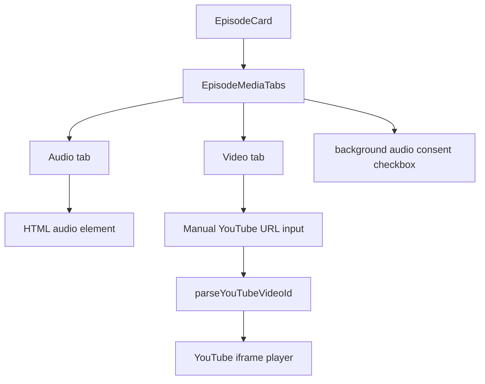

### State Code

```tsx
const [activeMode, setActiveMode] = useState<MediaMode>("audio");
const [backgroundAudioConsentGiven, setBackgroundAudioConsentGiven] =
  useState(false);
const [youtubeUrlInput, setYoutubeUrlInput] = useState("");
const [youtubeUrl, setYoutubeUrl] = useState("");
const [videoError, setVideoError] = useState("");
const [backgroundAudioError, setBackgroundAudioError] = useState("");
```

### What This Does

```ts
activeMode
```

Controls whether Audio or Video tab is visible.

```ts
backgroundAudioConsentGiven
```

Controls whether video-to-audio handoff is allowed.

```ts
youtubeUrlInput
```

What the user is typing.

```ts
youtubeUrl
```

The accepted YouTube URL currently loaded.

```ts
videoError
backgroundAudioError
```

Messages shown to the user.

### Derived State Code

```tsx
const youtubeVideoId = useMemo(
  () => parseYouTubeVideoId(youtubeUrl),
  [youtubeUrl],
);

const hasVideo = youtubeVideoId !== null;
const audioTabIsActive = activeMode === "audio";
const videoTabIsActive = activeMode === "video";
const videoContinuityIsEnabled =
  backgroundAudioConsentGiven && hasVideo && videoTabIsActive && !!audioUrl;
```

### What This Does

This keeps JSX readable.

Instead of repeating long conditions everywhere, the component uses names:

```text
hasVideo
audioTabIsActive
videoTabIsActive
videoContinuityIsEnabled
```

## 26. Manual YouTube Video Loading

### Real Code

```tsx
const loadVideo = (event: SubmitEvent<HTMLFormElement>): void => {
  event.preventDefault();

  const nextVideoUrl = youtubeUrlInput.trim();
  if (!nextVideoUrl) {
    setYoutubeUrl("");
    setVideoError("");
    return;
  }

  if (!parseYouTubeVideoId(nextVideoUrl)) {
    setYoutubeUrl("");
    setVideoError("Paste a valid YouTube video link.");
    return;
  }

  setYoutubeUrl(nextVideoUrl);
  setVideoError("");
};
```

### What This Does

```tsx
event.preventDefault();
```

Stops form submit from refreshing the page.

```ts
parseYouTubeVideoId(nextVideoUrl)
```

Checks whether the pasted value contains a valid YouTube video id.

If valid:

```ts
setYoutubeUrl(nextVideoUrl)
```

That triggers `youtubeVideoId`, which then allows the player to mount.

## 27. YouTube Player Wrapper

The file:

```text
features/ihate-music-podcast/youtubePlayer.ts
```

keeps YouTube iframe API details out of the React component.

### Player Creation Code

```ts
export async function createYouTubePlayer({
  mountElement,
  onStateChange,
  videoId,
}: CreateYouTubePlayerParams): Promise<YouTubePlayer> {
  const youTubeApi = await loadYouTubeIframeApi();

  return new youTubeApi.Player(mountElement, {
    host: "https://www.youtube.com",
    videoId,
    playerVars: {
      modestbranding: 1,
      origin: window.location.origin,
      playsinline: 1,
      rel: 0,
      widget_referrer: window.location.href,
    },
    events: {
      onStateChange,
    },
  });
}
```

### What This Does

```ts
loadYouTubeIframeApi()
```

Loads YouTube's global iframe script once.

```ts
origin: window.location.origin
```

Tells YouTube which site is embedding the player.

```ts
onStateChange
```

Lets `EpisodeMediaTabs` react when YouTube starts, pauses, or ends.

## 28. Video To Audio Handoff

This feature only runs when all of these are true:

```text
user is on Video tab
valid YouTube video is loaded
episode has Acast audio
user checked the background audio consent box
```

### Handoff Schema

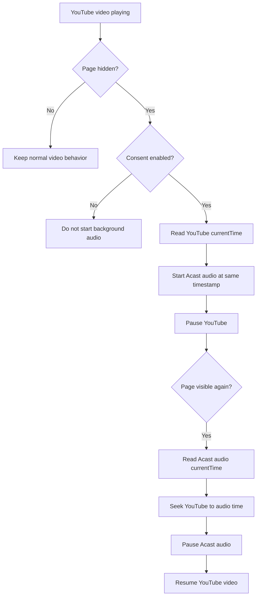

### Handoff Effect Code

```tsx
useEffect(() => {
  if (!videoContinuityIsEnabled) return;

  const syncMediaOnVisibilityChange = (): void => {
    const audioElement = audioRef.current;
    const youtubePlayer = youtubePlayerRef.current;
    if (!audioElement || !youtubePlayer) {
      return;
    }

    if (document.hidden) {
      const videoWasPlaying =
        youtubePlayer.getPlayerState() === YOUTUBE_PLAYING_STATE;

      shouldResumeVideoFromAudioRef.current = videoWasPlaying;
      if (!videoWasPlaying) {
        return;
      }

      const videoTimestamp = youtubePlayer.getCurrentTime();

      void playAudioFromTimestamp(
        audioElement,
        videoTimestamp,
      )
        .then(() => {
          if (document.hidden && shouldResumeVideoFromAudioRef.current) {
            youtubePlayer.pauseVideo();
          }
        })
        .catch(() => {
          cancelVideoToAudioHandoff();
          setBackgroundAudioError(
            "Background audio could not start, so the video was not switched.",
          );
        });
      return;
    }

    if (!shouldResumeVideoFromAudioRef.current) {
      return;
    }

    cancelVideoToAudioHandoff();
    youtubePlayer.seekTo(audioElement.currentTime, true);
    audioElement.pause();
    youtubePlayer.playVideo();
  };

  document.addEventListener("visibilitychange", syncMediaOnVisibilityChange);
  return () => {
    document.removeEventListener(
      "visibilitychange",
      syncMediaOnVisibilityChange,
    );
  };
}, [cancelVideoToAudioHandoff, videoContinuityIsEnabled]);
```

### What This Does

```ts
if (!videoContinuityIsEnabled) return;
```

If the user did not consent, the effect does not run.

```ts
document.hidden
```

Detects whether the tab/page is hidden.

```ts
youtubePlayer.getPlayerState() === YOUTUBE_PLAYING_STATE
```

Only hand off if the video was actually playing.

```ts
playAudioFromTimestamp(audioElement, videoTimestamp)
```

Starts Acast audio at the same timestamp.

```ts
youtubePlayer.pauseVideo()
```

Stops the YouTube video once audio has started.

```ts
youtubePlayer.seekTo(audioElement.currentTime, true)
```

When the page becomes visible again, YouTube resumes at the audio timestamp.

## 29. Audio Timing Helper

### Real Code

```ts
export async function playAudioFromTimestamp(
  audioElement: HTMLAudioElement,
  seconds: number,
): Promise<void> {
  if (audioElement.readyState < MEDIA_HAVE_METADATA) {
    await waitForAudioMetadata(audioElement);
  }

  seekAudioTo(audioElement, seconds);
  await audioElement.play();
}
```

### What This Does

Audio cannot always seek immediately.

The browser sometimes needs metadata first.

So the helper:

```text
1. waits for metadata if needed
2. seeks to the requested timestamp
3. starts playback
```

## 30. Database Setup And Tests

The database script hub is:

```text
database/scripts/run-database-setup.ts
```

The database test hub is:

```text
database/scripts/test-database.ts
```

### Setup Hub Code

```ts
const databaseScripts = [
  {
    name: "auth/run-better-auth-migrations",
    run: runBetterAuthMigrationsScript,
  },
  {
    name: "users/create-local-owner",
    run: runCreateLocalOwnerScript,
  },
];

async function main(): Promise<void> {
  for (const script of databaseScripts) {
    console.log(`Running database script: ${script.name}`);
    await script.run();
  }

  console.log("All database scripts finished.");
}
```

### What This Does

This lets one script run all database setup steps.

Future setup scripts should be added to:

```ts
const databaseScripts = [...]
```

### Test Hub Code

```ts
const databaseTestSuites = [
  {
    name: "users/integration",
    run: runUserDatabaseTests,
  },
];

async function main(): Promise<void> {
  for (const testSuite of databaseTestSuites) {
    console.log(`Running database test suite: ${testSuite.name}`);
    await testSuite.run();
  }

  console.log("All database test suites passed.");
}
```

### What This Does

This lets one command test all database feature suites.

Future database test suites should be added to:

```ts
const databaseTestSuites = [...]
```

## 31. Common Learning Pattern

When reading any feature, ask these questions:

```text
1. Is this a UI file?
   If yes, it should mostly render and call functions.

2. Is this a state file?
   If yes, it should coordinate state and actions.

3. Is this a server/database file?
   If yes, it should validate, check permissions, and read/write data.

4. Is this a parser/helper file?
   If yes, it should turn messy external data into clean internal objects.
```

## 32. Recommended Reading Order

Read in this order when studying the project:

```text
1. app/layout.tsx
2. components/navbar/shared/Navbar/Navbar.tsx
3. components/navbar/shared/Navbar/NavbarStyle.module.css
4. components/navbar/state.ts
5. components/navbar/config.ts
6. one navbar cell, such as EISLogoCell.tsx
7. features/account-auth/AccountAuthPanel.tsx
8. lib/client/auth/auth-client.ts
9. app/api/auth/[...all]/route.ts
10. lib/server/auth/auth.ts
11. lib/server/auth/better-auth-database.ts
12. lib/server/database/turso-client.ts
13. lib/server/database/users/validation/validate-user-input.ts
14. lib/server/database/users/read/read-users.ts
15. lib/server/database/users/write/write-users.ts
16. lib/podcast/acast.ts
17. features/ihate-music-podcast/IHateMusicPodcastPage.tsx
18. features/ihate-music-podcast/EpisodeMediaTabs.tsx
19. features/ihate-music-podcast/youtubePlayer.ts
20. features/ihate-music-podcast/mediaTiming.ts
```

## 33. Quick Glossary

```text
component:
  React function that returns UI.

state:
  Data React remembers between renders.

ref:
  React object that points to a real DOM element or mutable value.

route:
  URL-driven page in the Next.js app folder.

server file:
  Code that runs on the server and can access secrets.

client file:
  Code that runs in the browser and must not access secrets.

hook:
  Function that runs at a special time, such as before Better Auth creates a user.

lookup field:
  Database field used for search or uniqueness, usually normalized.

soft delete:
  Marking a row deleted without physically removing it.

handoff:
  Passing playback from YouTube video to Acast audio or back again.
```

## 34. Most Important Safety Rules

```text
Never expose TURSO_AUTH_TOKEN to browser code.
Never let public signup choose role.
Never let normal role editing assign owner.
Never treat deleted and disabled as the same state.
Never make podcast UI parse raw RSS directly.
Never put navbar cell-specific art rules into Navbar.tsx unless the rule is truly shared.
```

## 35. Short Version Of The Whole Project

```text
app/layout.tsx keeps Navbar alive.
Navbar.tsx orders cells and measures geometry.
state.ts owns navbar actions and route navigation.
CSS modules paint artwork and scaled layout.

AccountAuthPanel uses authClient.
authClient talks to /api/auth/[...all].
Better Auth stores passwords/sessions.
Better Auth hooks create normal project users.
Project user functions own role/status rules.

Podcast route fetches Acast RSS hourly.
acast.ts parses RSS into objects.
Podcast page renders those objects.
EpisodeMediaTabs controls audio/video playback.
YouTube handoff only runs with user consent.
```
