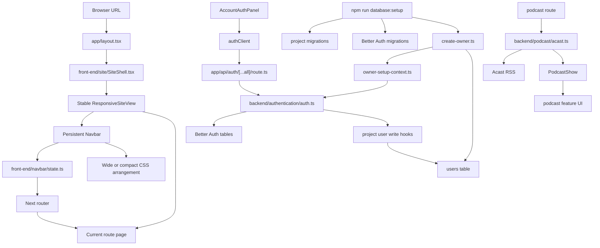

# Project_Explained: Earth In Sound Guide

## Purpose

This guide explains how the current Earth In Sound codebase communicates across
files. Use it to trace behavior, not to read copied source code.

Every flow answers the same questions:

- **Trigger:** what starts the behavior.
- **Path:** which files/functions are called.
- **Data:** what crosses the boundary.
- **Owner:** which file owns the rule.
- **Reason:** why the boundary exists.
- **Read:** where to inspect the implementation.

Source comments explain local line-level details. This guide explains system
ownership and communication.

## Codebase Layout

The project logic is split by runtime boundary:

- **`front-end/`:** browser-facing React code, responsive site frame, navbar,
  account UI, podcast UI, and the browser Better Auth client.
- **`backend/`:** server-only authentication, database access, migrations,
  setup scripts, external podcast feed parsing, and the reserved mailing area.
- **`app/`:** Next.js routing glue. Route files stay here because the framework
  discovers pages and API handlers from `app/`.
- **`public/`:** static assets served directly by Next.js.

## Project Model

Earth In Sound has five main systems:

- **Routes:** Next.js renders the active page under `app/layout.tsx`.
- **Responsive shell:** one permanent React tree adapts through component CSS.
- **Navbar:** custom controls send intent to shared navbar state.
- **Auth/users:** Better Auth owns credentials and sessions; the project
  `users` table owns roles, status, and public identity.
- **Podcast:** the server converts Acast RSS into project-owned data before
  React renders it.



## Flow 1: Route Rendering

- **Trigger:** browser opens `/`, `/account`, `/store`, `/cart`, a Jason Walton
  route, or an I Hate Music route.
- **Path:** browser URL -> Next.js App Router -> `app/layout.tsx` ->
  `SiteShell` -> stable `ResponsiveSiteView` -> persistent `Navbar` plus the
  matching `app/(site)/**/page.tsx`.
- **Data:** URL path and React `children`.
- **Owner:** `app/layout.tsx` owns the document shell; `SiteShell` owns the
  permanent application boundary; `ResponsiveSiteView` owns the navbar/page
  frame; route `page.tsx` files own page-specific content.
- **Reason:** responsive presentation must not replace the route subtree.
  Keeping one frame mounted preserves focus, forms, navbar state, and podcast
  playback while CSS adapts the layout.
- **Read:** `app/layout.tsx`, `front-end/site/SiteShell.tsx`,
  `front-end/site/ResponsiveSiteView.tsx`,
  `app/(site)/**/page.tsx`.

## Flow 2: Responsive Presentation

- **Trigger:** available layout width changes.
- **Path:** features use local media queries; the navbar measures browser-window
  changes in `layoutGeometry.ts` -> `state.ts` publishes wide/compact state ->
  `ResponsiveNavbar.tsx` exposes `data-navbar-layout` -> CSS rearranges the same
  controls.
- **Data:** browser-reported viewport width for the exact breakpoint,
  scrollbar-free layout width for fitting, navbar reference widths, layout
  attribute, and component-owned CSS variables.
- **Owner:** each feature owns its responsive styles. The navbar wide layout is
  owned by `ResponsiveNavbar.module.css`; its compact arrangement is owned by
  `ResponsiveNavbar.compact.module.css`.
- **Reason:** width changes affect presentation, not application identity. No
  JavaScript device classification or desktop/mobile component swap is needed.
- **Boundary:** zoom-independent `window.innerWidth <= 1024px` uses the compact
  navbar; wider widths use the wide navbar. Page zoom preserves the prior
  reference. Fitting uses `document.documentElement.clientWidth`, so scrollbar
  space cannot push the centered navbar outside the page.
- **Read:** `front-end/site/ResponsiveSiteView.tsx`,
  `front-end/navbar/ResponsiveNavbar.module.css`,
  `front-end/navbar/ResponsiveNavbar.compact.module.css`, and the affected feature's
  CSS module.

## Flow 3: Navbar Navigation

- **Trigger:** user clicks, drags, or keyboard-activates a navbar control.
- **Path:** navbar cell -> `useNavbarContext()` -> action from
  `front-end/navbar/state.ts` -> `setVisualState(...)` -> `router.push(...)`
  -> pathname changes -> `getRouteVisualState(...)` syncs the active control.
- **Data:** section id, link index, target route, current pathname,
  `activePage`, `eisSliderPos`, `isStorePressed`, `isCartPressed`.
- **Owner:** `state.ts` owns route mapping and shared actions; cell components
  own artwork, events, labels, and state classes.
- **Reason:** cells should express user intent, not duplicate route rules.
  Example: `EISLogoCell` sends index `1`; `state.ts` translates it to `/about`.
- **Read:** `front-end/navbar/state.ts`,
  `front-end/navbar/cells/EISLogoCell/EISLogoCell.tsx`,
  `front-end/navbar/shared/KnobJackCell/KnobJackCell.tsx`.

## Flow 4: Navbar Scaling

- **Trigger:** viewport resize, browser zoom, font load, page restore, or navbar
  cell size change.
- **Path:** `layoutGeometry.ts` separates real resize from page zoom ->
  `state.ts` stores the zoom-independent reference and selects wide/compact ->
  `ResponsiveNavbar.tsx` exposes that mode through
  `data-navbar-layout` -> every navbar CSS module and `StoreCell.tsx` consumes
  the same mode -> `layoutGeometry.ts` measures that arrangement -> `state.ts`
  calculates `scale` -> `ResponsiveNavbar.tsx` writes geometry CSS variables.
- **Data:** outer window width, live layout viewport width, device pixel ratio,
  screen context, stable reference width, pointer position, compact/wide row widths,
  rendered row width, layout mode, `scale`, CSS variables.
- **Owner:** `layoutGeometry.ts` owns arrangement-aware DOM measurements;
  `state.ts` owns shared scale values; `ResponsiveNavbar.tsx` owns the persistent
  navbar DOM and CSS-variable output; CSS modules own artwork layout.
- **Reason:** one shared mode prevents row structure, plaques, jacks, and Store
  media from disagreeing. Real browser-window resizing and device orientation
  can cross the 1024px breakpoint; browser page zoom cannot. Separate
  compact/wide measurement baselines prevent stale geometry, flexbox centers
  rows that fit, and zoom overflow follows the pointer.
- **Read:** `front-end/navbar/state.ts`,
  `front-end/navbar/layoutGeometry.ts`,
  `front-end/navbar/ResponsiveNavbar.tsx`,
  `front-end/navbar/ResponsiveNavbar.module.css`,
  `front-end/navbar/ResponsiveNavbar.compact.module.css`.

## Flow 5: Signup

- **Trigger:** logged-out user submits the account form in sign-up mode.
- **Path:** `AccountAuthPanel` -> `authClient.signUp.email(...)` ->
  `app/api/auth/[...all]/route.ts` -> `auth.ts` -> `user.create.before` ->
  Better Auth creates auth user -> `user.create.after` ->
  `createNormalUserAfterSignup(...)` -> `users` table -> `session.refetch()`.
- **Data:** email, password, username passed as Better Auth `name`, Better Auth
  `user.id`, project `role = user`, project `status = active`.
- **Owner:** Better Auth owns passwords/sessions; `auth.ts` owns hooks;
  `write-users.ts` owns project profile creation.
- **Reason:** signup needs two server-side records: the Better Auth auth record
  and the project profile. Hooks keep the browser from needing a second request.
- **Current limitation:** email format is validated, but mailbox ownership is
  not verified yet.
- **Read:** `front-end/features/account-auth/AccountAuthPanel.tsx`,
  `front-end/authentication/auth-client.ts`, `app/api/auth/[...all]/route.ts`,
  `backend/authentication/auth.ts`,
  `backend/database/users/write/write-users.ts`.

## Flow 6: Sign-In, Session, And Navbar Login State

- **Trigger:** user signs in, signs out, or UI checks the current session.
- **Path:** `authClient.signIn.email(...)` -> auth API route -> Better Auth
  password/session logic -> `auth.ts` `session.create.before` ->
  `getUserByAuthProviderId(...)` -> allow only active project users ->
  `authClient.useSession()` updates UI.
- **Data:** email/password, Better Auth `user.id`, project user status, session
  user data.
- **Owner:** Better Auth owns cookies and sessions; `auth.ts` owns active-user
  session blocking; navbar state reads `authClient.useSession()` for display.
- **Reason:** valid credentials are not enough. The project decides whether the
  linked user is active, disabled, deleted, or missing.
- **Read:** `backend/authentication/auth.ts`, `front-end/navbar/state.ts`,
  `front-end/navbar/cells/AccountCell/AccountCell.tsx`,
  `front-end/features/account-auth/AccountAuthPanel.tsx`.

## Flow 7: Owner Creation

- **Trigger:** `npm run database:setup` runs with `LOCAL_OWNER_EMAIL`,
  `LOCAL_OWNER_USERNAME`, and `LOCAL_OWNER_PASSWORD`.
- **Path:** `run-database-setup.ts` -> project migrations -> Better Auth
  migrations -> `create-owner.ts` -> `runWithOwnerSetupContext(...)` ->
  Better Auth sign-up/sign-in -> `createOrLinkOwnerAfterSignup(...)` ->
  remove setup-created sessions.
- **Data:** owner env vars, Better Auth `user.id`, project `role = owner`,
  project `status = active`.
- **Owner:** `create-owner.ts` owns terminal owner setup;
  `owner-setup-context.ts` marks the trusted setup call;
  `createOrLinkOwnerAfterSignup(...)` owns the owner row.
- **Reason:** owner is too powerful for public signup. Owner creation requires a
  server-only setup context that browser requests cannot enter.
- **Read:** `backend/database/scripts/run-database-setup.ts`,
  `backend/database/scripts/users/create-owner/create-owner.ts`,
  `backend/authentication/owner-setup-context.ts`,
  `backend/database/users/write/write-users.ts`.

## Flow 8: Project User Lifecycle

- **Trigger:** future trusted server code calls `updateUsername`, `disableUser`,
  `deleteUser`, `reactivateUser`, `transferOwnership`, or `setUserRole`.
- **Path:** trusted caller derives current user from session -> `write-users.ts`
  loads current and target users -> permission/status checks -> optional Better
  Auth lifecycle helper -> update `users` table -> return updated `StoredUser`.
- **Data:** trusted `currentUserId` or `currentOwnerId`, `targetUserId`,
  requested username/role/status, Better Auth `user.id` when auth sessions or
  auth accounts must change.
- **Owner:** `write-users.ts` owns mutations; `user-permissions.ts` owns
  permission checks; `auth-user-lifecycle.ts` owns Better Auth session/account
  helper calls.
- **Reason:** lifecycle rules must be centralized. Browser input must never
  decide `currentUserId` or `currentOwnerId`; server code must derive that from
  the authenticated session.
- **Status rules:** disabled users keep email/username reserved and cannot
  create sessions. Deleted users lose the Better Auth account, release email
  lookup, and keep username lookup permanently reserved.
- **Current limitation:** Better Auth changes and project table changes are
  separate operations. Future production routes should add recovery for partial
  failure.
- **Read:** `backend/database/users/write/write-users.ts`,
  `backend/database/users/permissions/user-permissions.ts`,
  `backend/authentication/auth-user-lifecycle.ts`.

## Flow 9: Database Setup And Migrations

- **Trigger:** `npm run database:setup`.
- **Path:** `run-database-setup.ts` -> `run-project-migrations.ts` ->
  `backend/database/migrations/*.sql` -> record in `project_migrations` -> Better Auth
  migration script -> owner creation script.
- **Data:** `TURSO_DATABASE_URL`, `TURSO_AUTH_TOKEN`, `BETTER_AUTH_SECRET`,
  `BETTER_AUTH_URL`, optional `LOCAL_OWNER_*`, SQL migration ids.
- **Owner:** `backend/database/migrations/*.sql` owns project schema;
  `run-project-migrations.ts` owns ordering/history; Better Auth migration
  script owns auth tables.
- **Reason:** project tables and Better Auth tables both need setup. The hub
  runs them in the required order before owner setup.
- **Current caution:** the existing-users baseline assumes the table matches the
  known project schema. Unknown or manually edited schemas should be checked
  before trusting that baseline.
- **Read:** `backend/database/scripts/run-database-setup.ts`,
  `backend/database/scripts/run-project-migrations/run-project-migrations.ts`,
  `backend/database/migrations/*.sql`,
  `backend/database/scripts/auth/run-better-auth-migrations/run-better-auth-migrations.ts`.

## Flow 10: Database Tests

- **Trigger:** `npm run test:database`.
- **Path:** `test-database.ts` -> `test-user-database.ts` -> disposable local
  database -> project migrations -> Better Auth migrations -> auth/user
  lifecycle assertions.
- **Data:** temporary database URL, generated test identities, Better Auth
  sessions, project user rows.
- **Owner:** `test-user-database.ts` owns current integration coverage;
  `test-user-helpers.ts` owns small assertion helpers.
- **Reason:** lifecycle tests create and delete data aggressively. A disposable
  database keeps real local or production data clean.
- **Current coverage:** owner linking, signup mirroring, disabled session
  blocking, role changes, ownership transfer, single-owner enforcement, email
  reuse after deletion, permanent username reservation after deletion.
- **Read:** `backend/database/scripts/test-database.ts`,
  `backend/database/scripts/users/test-users/test-user-database.ts`,
  `backend/database/scripts/users/test-users/test-user-helpers.ts`.

## Flow 11: Podcast Loading

- **Trigger:** user opens `/i-hate-music/podcast`.
- **Path:** podcast route -> `loadPodcastShowSafely()` ->
  `getIHateMusicShow()` -> fetch Acast RSS -> `fast-xml-parser` ->
  `PodcastShow` -> `IHateMusicPodcastPage` -> `EpisodeMediaTabs` ->
  `useEpisodeMediaController()` -> `useVideoAudioContinuity()`.
- **Data:** external RSS XML, `PodcastShow`, `PodcastEpisode[]`, audio URL,
  episode URL, cover image URL, manual YouTube URL entered by user, consent for
  background audio handoff.
- **Owner:** `backend/podcast/acast.ts` owns feed parsing;
  `IHateMusicPodcastPage.tsx` owns page layout; `EpisodeMediaTabs.tsx` renders
  per-episode controls; `useEpisodeMediaController.ts` owns tab/video state and
  YouTube setup; `useVideoAudioContinuity.ts` owns consent and provider handoff;
  `youtubePlayer.ts` owns the iframe message boundary; `mediaTiming.ts` owns
  safe Acast timestamp seeking.
- **Reason:** external feed quirks stay server-side. React receives clean
  project-owned data, not raw XML.
- **Media rule:** consent prepares Acast audio before backgrounding. Browsers
  that support concurrent media keep muted Acast standby synced under YouTube;
  iOS/iPadOS uses prepared handoff without concurrent standby.
- **Current limitation:** the page renders the full RSS archive at once. For
  performance work, start with pagination or lazy media mounting.
- **Read:** `app/(site)/i-hate-music/podcast/page.tsx`,
  `backend/podcast/acast.ts`,
  `front-end/features/ihate-music-podcast/IHateMusicPodcastPage.tsx`,
  `front-end/features/ihate-music-podcast/EpisodeMediaTabs.tsx`,
  `front-end/features/ihate-music-podcast/useEpisodeMediaController.ts`,
  `front-end/features/ihate-music-podcast/useVideoAudioContinuity.ts`,
  `front-end/features/ihate-music-podcast/youtubePlayer.ts`,
  `front-end/features/ihate-music-podcast/mediaTiming.ts`.

## Flow 12: Navbar Assets

- **Trigger:** navbar cell renders, hovers, focuses, presses, or becomes active.
- **Path:** component state/class -> CSS module -> `/public/NavbarAssets/...`
  -> browser paints image/font/video.
- **Data:** state class, `background-image`, `font-face`, `video src`.
- **Owner:** TypeScript owns interaction state; CSS owns visible artwork;
  `public/NavbarAssets` owns static files.
- **Reason:** artwork changes should mostly stay in CSS/assets. TypeScript
  should decide behavior, not hardcode visual layers.
- **Responsive rule:** the same controls remain mounted. The shared layout state
  selects compact plaques and Store animation files. Store assigns video URLs
  only after layout resolution, avoiding preload of the wrong asset family.
- **Read:** `front-end/navbar/cells/*.tsx`,
  `front-end/navbar/cells/*.module.css`,
  `front-end/navbar/shared/KnobJackCell/*`,
  `front-end/navbar/ResponsiveNavbar.compact.module.css`,
  `public/NavbarAssets/`.

## File Ownership Reference

- `app/layout.tsx`: document shell and App Router layout boundary.
- `front-end/site/SiteShell.tsx`: permanent site-shell boundary.
- `front-end/site/ResponsiveSiteView.tsx`: stable navbar plus page frame.
- `front-end/navbar/Navbar.tsx`: one persistent navbar state provider.
- `front-end/navbar/state.ts`: navbar behavior and route state.
- `front-end/navbar/layoutGeometry.ts`: window classification and row measurement.
- `front-end/navbar/ResponsiveNavbar.tsx`: persistent navbar DOM,
  measurement synchronization, and CSS variables.
- `front-end/navbar/cells/*`: individual shared navbar controls.
- `front-end/navbar/ResponsiveNavbar.compact.module.css`: compact arrangement.
- `front-end/features/account-auth/AccountAuthPanel.tsx`: account form UI.
- `app/api/auth/[...all]/route.ts`: Better Auth HTTP entry.
- `backend/authentication/auth.ts`: auth config, signup hooks, session guard.
- `backend/database/users/*`: project user validation, reads, permissions,
  writes.
- `backend/database/migrations/*`: project schema.
- `backend/database/scripts/*`: setup and database tests.
- `backend/podcast/acast.ts`: Acast RSS boundary.
- `backend/mailing/*`: future transactional email/mailing boundary.
- `front-end/features/ihate-music-podcast/*`: podcast page and media UI.

## Change Rules

- **Navigation:** update navbar route maps and the affected cell.
- **Responsive presentation:** keep one component tree. Features may use local
  media queries; the navbar must use its shared zoom-independent layout state so
  arrangement, artwork, measurement, and video sources cannot disagree.
- **Account rules:** decide first whether the rule belongs to Better Auth or
  project users.
- **Owner behavior:** keep owner creation server-only and keep database
  single-owner enforcement.
- **Schema:** add a migration and a database test.
- **Podcast data:** parse external feed data in `backend/podcast/acast.ts`, not in
  React UI.
- **Artwork:** prefer CSS/assets unless behavior changes.

## Verification Checklist

- **Guide/source sync:** guide describes current communication; source comments
  explain tricky local logic; guide avoids copied source code.
- **Auth/users:** public signup creates normal users only; owner is setup-only;
  disabled/deleted users cannot create sessions; deleted email can be reused;
  deleted username stays reserved; project users never store passwords.
- **Database:** schema changes are migrations; single-owner enforcement remains
  in the database; new behavior has tests.
- **Frontend:** navbar visual state follows the URL; responsive changes do not
  remount the site frame; custom controls stay keyboard-accessible; wide,
  compact, and exact breakpoint widths are checked manually.
- **Commands:** `npm run type-check`, `npm run lint -- --max-warnings=0`,
  `npm run test:database`.

## Learning Order

```text
1. app/layout.tsx
2. front-end/site/SiteShell.tsx
3. front-end/site/ResponsiveSiteView.tsx
4. front-end/navbar/Navbar.tsx
5. front-end/navbar/state.ts
6. front-end/navbar/layoutGeometry.ts
7. front-end/navbar/ResponsiveNavbar.tsx
8. front-end/navbar/ResponsiveNavbar.module.css
9. front-end/navbar/ResponsiveNavbar.compact.module.css
10. one navbar cell
11. front-end/features/account-auth/AccountAuthPanel.tsx
12. app/api/auth/[...all]/route.ts
13. backend/authentication/auth.ts
14. backend/database/users/write/write-users.ts
15. backend/database/scripts/run-database-setup.ts
16. backend/database/scripts/users/create-owner/create-owner.ts
17. backend/database/scripts/users/test-users/test-user-database.ts
18. app/(site)/i-hate-music/podcast/page.tsx
19. backend/podcast/acast.ts
20. front-end/features/ihate-music-podcast/IHateMusicPodcastPage.tsx
21. front-end/features/ihate-music-podcast/EpisodeMediaTabs.tsx
22. front-end/features/ihate-music-podcast/useEpisodeMediaController.ts
23. front-end/features/ihate-music-podcast/useVideoAudioContinuity.ts
```

## Glossary

- **Boundary:** where one responsibility hands data to another.
- **Better Auth user:** auth-library record that owns password/session identity.
- **Project user:** Earth In Sound `users` row that owns role, status, and
  public identity.
- **`auth_provider_user_id`:** Better Auth `user.id` stored on the project row.
- **Lookup field:** lowercase unique/search key for email or username.
- **Owner setup context:** server-only trust marker for first-owner setup.
- **Latched control:** navbar utility control that stays pressed for its route.
- **RSS boundary:** server parser that converts external XML to project data.
- **Responsive presentation:** CSS rearranges existing components without
  replacing their React identity.

## Short Version

The layout mounts one stable `SiteShell`. `ResponsiveSiteView` keeps the navbar
and current route mounted while component CSS rearranges them for available
width. The navbar's shared state translates user intent into routes. Better Auth
owns authentication; the project users table owns roles, status, and identity
rules. Setup prepares both database systems and creates the owner through a
server-only path. The podcast route fetches RSS on the server and gives React
clean project data.
