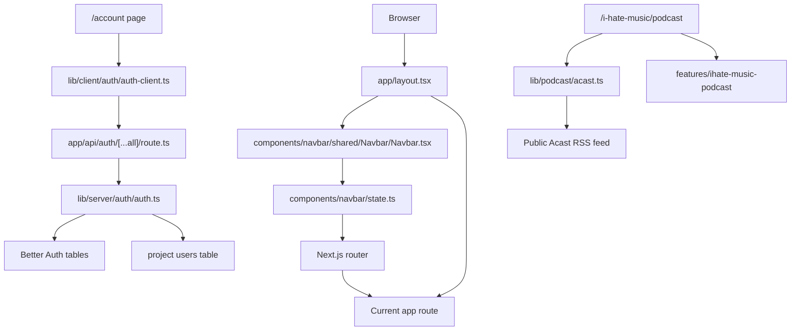
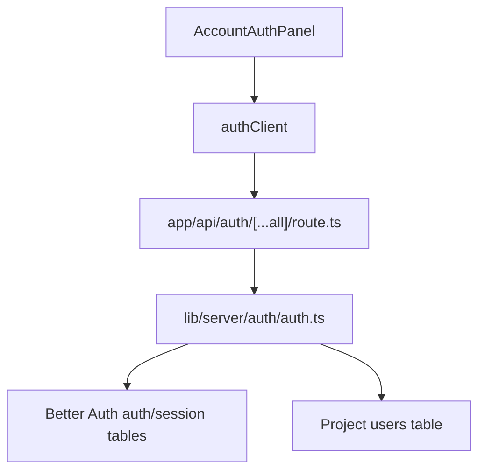
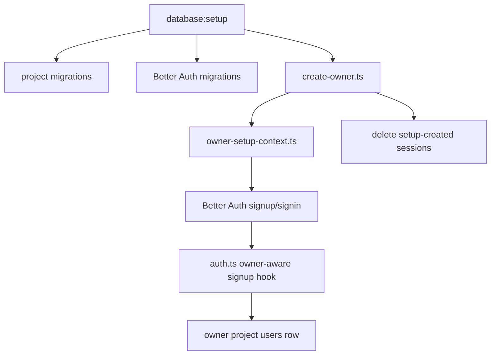
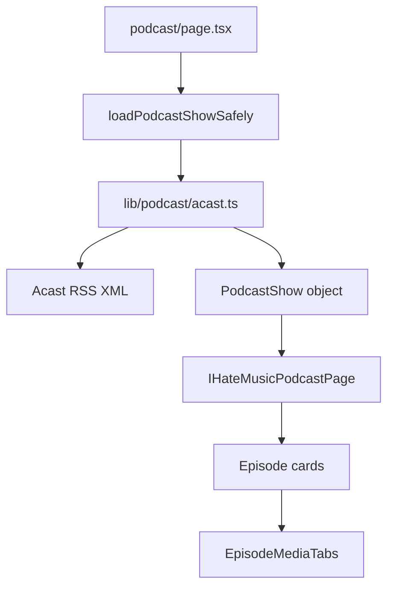

# Project_Explained: Earth In Sound Guide

## How To Use This File

This file is the project map and learning path.

It should explain:

```text
what each system is for
where the important files live
how data moves between systems
which rules the current code is enforcing
where to make common changes
```

It should not copy large blocks of source code. The detailed explanations for
specific logic now belong in comments beside that logic. When you study a
system, read this guide first, then open the referenced files and read the
local comments there.

## Current Project Shape

Earth In Sound is a Next.js App Router project with four main systems:

```text
App shell and routes
  app/

Permanent custom navbar
  components/navbar/

Authentication and project users
  app/api/auth/[...all]/route.ts
  lib/client/auth/
  lib/server/auth/
  lib/server/database/users/
  database/

I Hate Music podcast feature
  app/(site)/i-hate-music/podcast/page.tsx
  features/ihate-music-podcast/
  lib/podcast/acast.ts
```

The project is not a generic website template. The navbar is a custom interface
object, and most routes are connected through that object.

## Whole Project Flow



## File Map

```text
app/layout.tsx
  Root document shell. Mounts the permanent navbar once.

app/(site)/**/page.tsx
  Route pages rendered under the shared layout.

components/navbar/config.ts
  Static labels, route positions, knob geometry, and navbar sizing constants.

components/navbar/state.ts
  Shared navbar state, route mapping, account state, cart/store state, and scale.

components/navbar/shared/Navbar/Navbar.tsx
  Navbar shell, runtime measurements, CSS variable handoff, and cell order.

components/navbar/cells/*
  Individual navbar hardware cells.

components/navbar/shared/KnobJackCell/*
  Shared knob, LED, label, jack, and drag behavior for JWW and IHM sections.

features/account-auth/AccountAuthPanel.tsx
  Browser sign-up, sign-in, and sign-out UI.

lib/client/auth/auth-client.ts
  Browser-side Better Auth client.

app/api/auth/[...all]/route.ts
  Server route that delegates auth HTTP requests to Better Auth.

lib/server/auth/auth.ts
  Better Auth server config, signup hooks, and session guard.

lib/server/auth/auth-user-lifecycle.ts
  Better Auth internal adapter operations used by project account management.

lib/server/auth/owner-setup-context.ts
  Server-only trust context used during owner setup.

lib/server/auth/better-auth-database.ts
  Kysely/libSQL connection used by Better Auth tables.

lib/server/database/turso-client.ts
  Direct libSQL client used by project tables.

lib/server/database/users/read/read-users.ts
  Project user read functions.

lib/server/database/users/write/write-users.ts
  Project user write/lifecycle/role functions.

lib/server/database/users/permissions/user-permissions.ts
  Shared role/status permission helpers.

lib/server/database/users/validation/validate-user-input.ts
  Email, username, and lookup-value helpers.

database/migrations/*.sql
  Project schema migrations.

database/scripts/run-database-setup.ts
  Setup hub: project migrations, Better Auth migrations, owner setup.

database/scripts/run-project-migrations/run-project-migrations.ts
  Project migration runner and migration-history table.

database/scripts/users/create-owner/create-owner.ts
  First-owner creation/repair script.

database/scripts/test-database.ts
  Test hub for database-related integration tests.

lib/podcast/acast.ts
  Server-side Acast RSS fetcher/parser.

features/ihate-music-podcast/*
  Podcast route UI, media tabs, timing helpers, and YouTube wrapper.
```

## App Shell And Routes

The app shell starts in `app/layout.tsx`.

Important rule:

```text
layout.tsx owns the permanent frame
page.tsx files own route-specific content
```

`Navbar` is mounted above `{children}`, so the navbar survives route changes
while the current page content changes below it.

Route groups like `app/(site)` organize files without adding `(site)` to the
browser URL.

The current route pages are:

```text
/
/about
/contact
/account
/store
/cart
/jason-walton/biography
/jason-walton/discography
/jason-walton/production
/i-hate-music/podcast
/i-hate-music/community
/i-hate-music/patreon
```

Most non-podcast content routes currently use shared placeholder pages. That is
expected for this stage of the project.

## Navbar System

The navbar is split into:

```text
config
  stable labels, dimensions, knob geometry

state
  route mapping, active visual state, account state, store/cart state, scaling

shell
  measured layout, CSS variables, permanent cell order

cells
  artwork and interaction for each physical-looking control
```

Read in this order:

```text
1. components/navbar/config.ts
2. components/navbar/state.ts
3. components/navbar/shared/Navbar/Navbar.tsx
4. one cell, for example components/navbar/cells/EISLogoCell/EISLogoCell.tsx
5. components/navbar/shared/KnobJackCell/KnobJackCell.tsx
```

### Navbar Route Model

The physical controls map to routes:

```text
EIS slider
  0 -> /
  1 -> /about
  2 -> /contact

Jason Walton knob
  0 -> /jason-walton/biography
  1 -> /jason-walton/discography
  2 -> /jason-walton/production

I Hate Music knob
  0 -> /i-hate-music/podcast
  1 -> /i-hate-music/community
  2 -> /i-hate-music/patreon
```

`components/navbar/state.ts` owns both directions:

```text
control position -> route
route -> active control position
```

This is why refreshing a direct URL can still light the correct navbar control.

### Navbar Measurement Model

The navbar cannot be described with static CSS alone because the artwork has to
fit real viewport width, browser zoom, font loading, and measured cell widths.

The measurement flow is:

```text
state.ts calculates scale
Navbar.tsx measures rendered cells
Navbar.tsx writes CSS variables
NavbarStyle.module.css consumes those variables
cell CSS consumes shared artwork scale
```

The detailed comments for this live in:

```text
components/navbar/state.ts
components/navbar/shared/Navbar/Navbar.tsx
components/navbar/shared/Navbar/NavbarStyle.module.css
```

### Navbar Cells

```text
EISLogoCell
  Home/About/Contact slider and logo home action.

JasonWaltonCell
  Jason-specific logo/plaque artwork plus shared knob behavior.

IHateMusicCell
  IHM-specific logo/plaque artwork plus shared knob behavior.

AccountCell
  Small navbar account hardware. Reads Better Auth session state.

StoreCell
  Store screen artwork with hover/pressed video states.

CartCell
  Visual cart counter/button. Real cart data is not wired yet.
```

Current cart behavior is intentionally temporary: the navbar state seeds a count
so the cart visual can be tested before real cart data exists.

## Auth And Account System

The project has two user systems on purpose:

```text
Better Auth user
  owns password hashing, auth user id, sessions, cookies

Project users row
  owns visible username, email copy, role, lifecycle status
```

Never store passwords in the project `users` table.

### Auth Request Flow



### Signup Flow

Public signup uses:

```text
features/account-auth/AccountAuthPanel.tsx
lib/client/auth/auth-client.ts
app/api/auth/[...all]/route.ts
lib/server/auth/auth.ts
lib/server/database/users/write/write-users.ts
```

Important rules:

```text
public signup creates role = user
public signup cannot choose admin or owner
Better Auth receives username through its name field
the project stores Better Auth user.id in auth_provider_user_id
```

`auth.ts` has two project hooks:

```text
user.create.before
  validates and reserves email/username before Better Auth writes its user

user.create.after
  creates or links the matching project users row after Better Auth succeeds
```

Current limitation: mailbox ownership is not proven yet. Email verification is
the next production hardening area for this system.

### Session Guard

`auth.ts` also checks new sessions:

```text
no project row -> block
disabled user -> block
deleted user -> block
active user -> allow
signup/owner setup bridge moment -> allow while the project row is being linked
```

This keeps disabled and deleted accounts from creating fresh sessions.

## Project Users, Roles, And Status

The project `users` table is created by:

```text
database/migrations/001_create_users.sql
```

The single-owner database rule is created by:

```text
database/migrations/003_enforce_single_owner.sql
```

### User Row Meaning

```text
id
  internal Earth In Sound user id

auth_provider_user_id
  Better Auth user.id, nullable for legacy/unlinked setup states

email
  visible email copy

email_lookup
  lowercase unique email key

username
  visible username

username_lookup
  lowercase unique username key

role
  owner, admin, or user

status
  active, disabled, or deleted

created_at / updated_at
  Unix millisecond timestamps
```

### Role Rules

```text
owner
  highest role
  can transfer ownership
  can promote/demote active non-owner users
  cannot disable/delete self until ownership is transferred

admin
  can manage normal users
  cannot manage owner or other admins

user
  can manage own normal account actions
  cannot manage other users
```

Role comparisons live in:

```text
lib/server/database/users/permissions/user-permissions.ts
```

### Status Rules

```text
active
  can create sessions
  can perform allowed account actions

disabled
  cannot create sessions
  keeps email and username reserved
  can be reactivated

deleted
  cannot create sessions
  Better Auth account is removed
  email lookup is released for a future signup
  username lookup stays reserved permanently
  cannot be reactivated through the normal flow
```

The deleted-username rule is intentional. It prevents a future user from taking
a closed account's public identity.

## Owner Creation

The owner is not created by a browser signup.

The owner is created or repaired by:

```text
npm run database:setup
```

when these environment variables are present:

```text
LOCAL_OWNER_EMAIL
LOCAL_OWNER_USERNAME
LOCAL_OWNER_PASSWORD
```

Flow:



The owner setup context is server-only. Browser requests cannot enter that
context, so public signup cannot claim the owner role.

If an owner already exists and is linked to Better Auth, setup skips creation.
If a legacy owner row exists without an auth id, setup links it only when the
configured owner email and username match that row.

## Database Setup And Migrations

The setup hub is:

```text
database/scripts/run-database-setup.ts
```

It runs:

```text
1. project migrations
2. Better Auth migrations
3. owner creation/repair
```

Project migrations are ordinary SQL files in:

```text
database/migrations/
```

Migration history is stored in:

```text
project_migrations
```

When adding a migration:

```text
1. create a new numbered SQL file
2. make the migration safe to run once
3. prefer transaction-wrapped SQL for multi-step changes
4. add or update database tests when behavior changes
5. update this guide only if the project model changes
```

## Database Tests

Run all database tests:

```powershell
npm run test:database
```

The test hub is:

```text
database/scripts/test-database.ts
```

The current integration suite is:

```text
database/scripts/users/test-users/test-user-database.ts
```

It uses a disposable local database file, applies migrations, runs Better Auth
migrations, and tests the user/auth lifecycle.

Current coverage includes:

```text
owner linking
normal signup mirroring
disabled account session blocking
role changes
ownership transfer
single-owner database enforcement
delete behavior
email release after deletion
permanent username reservation after deletion
```

## Podcast System

The podcast route is:

```text
app/(site)/i-hate-music/podcast/page.tsx
```

The route loads data through:

```text
lib/podcast/acast.ts
```

The page UI lives in:

```text
features/ihate-music-podcast/IHateMusicPodcastPage.tsx
features/ihate-music-podcast/EpisodeMediaTabs.tsx
features/ihate-music-podcast/youtubePlayer.ts
features/ihate-music-podcast/mediaTiming.ts
```

### Podcast Data Flow



`lib/podcast/acast.ts` is the boundary between external RSS XML and the
project's clean `PodcastShow` shape. React components should not parse RSS or
know Acast XML details.

### Media Tabs

Each episode card renders audio controls and optional manual YouTube video
loading.

Responsibilities:

```text
EpisodeMediaTabs.tsx
  tab state, audio element, video URL form, consent state, handoff coordination

youtubePlayer.ts
  YouTube iframe API wrapper

mediaTiming.ts
  timestamp-safe Acast audio seeking
```

The current page renders the full RSS archive. If performance work is done
later, this is the area to inspect first.

## Assets

Static assets live in:

```text
public/NavbarAssets/
```

Browser paths start at `/NavbarAssets/...` because everything under `public` is
served from the web root.

The current navbar code references the desktop asset set. Mobile assets exist
but are not wired into a separate mobile navbar layout yet.

When changing artwork:

```text
1. keep the file in public/NavbarAssets
2. update the CSS file that owns that cell's artwork
3. check hover, focus, active, and route-active states
4. test desktop and narrow viewport behavior
```

## Common Change Recipes

### Add A Simple Route

```text
1. add app/(site)/new-route/page.tsx
2. decide whether it needs a feature folder
3. add metadata if useful
4. add route mapping only if the navbar should navigate to it
5. update this guide if it changes the project map
```

### Add Or Change A Navbar Stop

```text
1. update labels in components/navbar/config.ts
2. update NAVBAR_LINK_ROUTES in components/navbar/state.ts
3. update ACTIVE_PAGE_BY_ROUTE in components/navbar/state.ts
4. check the matching cell layout and labels
5. test keyboard, pointer, refresh, and browser back/forward
```

### Change Account Rules

```text
1. identify whether the rule belongs to Better Auth or project users
2. update lib/server/auth/auth.ts for Better Auth hooks/session behavior
3. update write-users.ts/read-users.ts for project profile behavior
4. update migrations if schema changes
5. update database tests
6. update this guide only with the new rule, not copied code
```

### Change Owner Behavior

```text
1. read owner-setup-context.ts
2. read create-owner.ts
3. read createOrLinkOwnerAfterSignup in write-users.ts
4. keep public signup unable to create owner/admin
5. keep the database single-owner constraint
6. update tests before trusting the change
```

### Change Podcast Data

```text
1. update lib/podcast/acast.ts if RSS parsing changes
2. update PodcastShow or PodcastEpisode types if the page needs new fields
3. update IHateMusicPodcastPage.tsx for layout changes
4. update EpisodeMediaTabs.tsx only for media behavior changes
```

## Requirements Checklist

Use this checklist after changes:

```text
Source and guide sync
  The guide describes the current system.
  Detailed local explanations live in source comments.
  The guide does not copy large code blocks.

Auth/user rules
  Public signup creates normal users only.
  Owner is created by setup, not public signup.
  Disabled users cannot create sessions.
  Deleted users cannot create sessions.
  Deleted email lookup is released.
  Deleted username lookup remains reserved.
  Passwords are never stored in project users.

Database rules
  Migrations are committed SQL files.
  New schema behavior has tests.
  The single-owner rule is enforced by the database.

Frontend rules
  Navbar route state matches the current URL.
  Custom controls remain keyboard-accessible.
  Text and controls remain usable on narrow screens.

Verification
  npm run type-check
  npm run lint -- --max-warnings=0
  npm run test:database
```

## Recommended Learning Order

For the current project, read in this order:

```text
1. app/layout.tsx
2. components/navbar/config.ts
3. components/navbar/state.ts
4. components/navbar/shared/Navbar/Navbar.tsx
5. one navbar cell
6. app/api/auth/[...all]/route.ts
7. lib/server/auth/auth.ts
8. lib/server/database/users/read/read-users.ts
9. lib/server/database/users/write/write-users.ts
10. database/migrations/*.sql
11. database/scripts/run-database-setup.ts
12. database/scripts/users/test-users/test-user-database.ts
13. lib/podcast/acast.ts
14. features/ihate-music-podcast/IHateMusicPodcastPage.tsx
15. features/ihate-music-podcast/EpisodeMediaTabs.tsx
```

Read slowly. The goal is not to memorize every line. The goal is to know which
file owns which decision.

## Glossary

```text
App Router
  Next.js routing system based on the app/ folder.

Better Auth
  Library that owns password hashing, auth users, sessions, and cookies.

Project user
  Earth In Sound row in the users table. Owns role, status, and display identity.

auth_provider_user_id
  Better Auth user.id stored in the project users table.

lookup field
  Lowercase value used for unique checks and searches.

owner setup context
  Server-only AsyncLocalStorage flag that allows the setup script to link owner.

soft delete
  Marking a user deleted while keeping the row for audit/history.

navbar cell
  One physical-looking region of the custom navbar.

latched control
  A utility button such as Store or Cart that stays visually pressed for a route.

RSS parser boundary
  The server-side place where external feed XML becomes project-owned data.
```

## Short Version

The permanent layout mounts the navbar. The navbar maps physical controls to
routes and keeps its visual state synced with the URL. Better Auth owns secure
auth data, while the project `users` table owns roles, usernames, statuses, and
identity reservations. Database setup applies project migrations, Better Auth
migrations, and first-owner setup. The podcast page fetches Acast RSS on the
server, converts it to clean project data, and renders it through feature
components.

This file tells you where to look. The source comments tell you why each tricky
piece of code is written the way it is.
